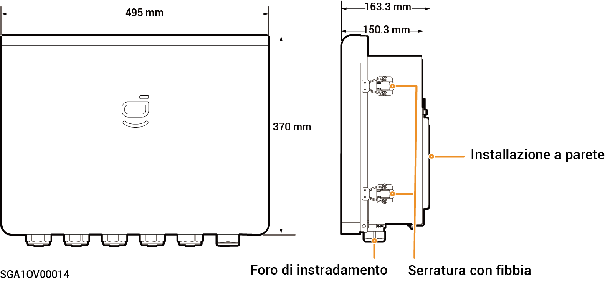

# Sigen Gateway Home SP 12K

### Dimensioni

<figure><figcaption></figcaption></figure>

### Vista interna

<figure><figcaption></figcaption></figure>

<table><thead><tr><th width="82">N.</th><th>Etichetta</th><th width="531">Descrizione</th></tr></thead><tbody><tr><td><strong>1</strong></td><td>-</td><td>Condotto sbarra in rame per il collegamento a terra</td></tr><tr><td><strong>2</strong></td><td>QS1</td><td>Interruttore di bypass</td></tr><tr><td><strong>3</strong></td><td>KM1</td><td>Contattore di rete</td></tr><tr><td><strong>4</strong></td><td>X1</td><td>Terminale (collegato a un carico che non necessita del backup)</td></tr><tr><td><strong>5</strong></td><td>-</td><td>Terminale FE</td></tr><tr><td><strong>6</strong></td><td>QF1</td><td>Interruttore automatico in miniatura (collegato alla rete)</td></tr><tr><td><strong>7</strong></td><td>QF2</td><td>Interruttore automatico in miniatura (collegato a un inverter monofase in una gamma di potenza da 8,0 a 12,0 kW)</td></tr><tr><td><strong>8</strong></td><td>QF3</td><td>Interruttore automatico in miniatura (collegato a un carico domestico)</td></tr><tr><td><strong>9</strong></td><td>QF4</td><td>Interruttore automatico in miniatura (collegato a un inverter monofase in una gamma di potenza da 3,0 a 6,0 kW)</td></tr><tr><td><strong>10</strong></td><td>-</td><td>Terminale (collegato al cavo di messa a terra funzionale)</td></tr></tbody></table>
