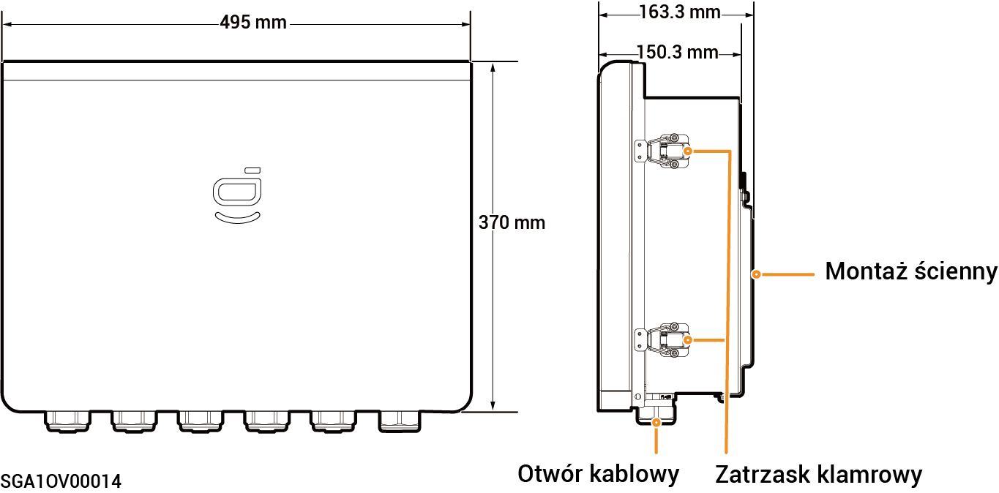

# Sigen Gateway Home SP 12K

### Wymiary

<figure><figcaption></figcaption></figure>

### Widok wnętrza

<figure><figcaption></figcaption></figure>

<table><thead><tr><th width="82">S/N</th><th>Etykieta</th><th width="531">Opis</th></tr></thead><tbody><tr><td><strong>1</strong></td><td>-</td><td>Uziemiająca szyna miedziana</td></tr><tr><td><strong>2</strong></td><td>QS1</td><td>Przełącznik obejścia</td></tr><tr><td><strong>3</strong></td><td>KM1</td><td>Stycznik sieci</td></tr><tr><td><strong>4</strong></td><td>X1</td><td>Złącze (do podłączenia obciążenia niezapasowego)</td></tr><tr><td><strong>5</strong></td><td>-</td><td>Złącze FE</td></tr><tr><td><strong>6</strong></td><td>QF1</td><td>Miniaturowy wyłącznik (do podłączenia sieci energetycznej)</td></tr><tr><td><strong>7</strong></td><td>QF2</td><td>Miniaturowy wyłącznik (połączony z falownikiem jednofazowym o zakresie mocy od 8,0 do 12,0 kW)</td></tr><tr><td><strong>8</strong></td><td>QF3</td><td>Miniaturowy wyłącznik (połączony z obciążeniem domowym)</td></tr><tr><td><strong>9</strong></td><td>QF4</td><td>Miniaturowy wyłącznik (połączony z falownikiem jednofazowym o zakresie mocy od 3,0 do 6,0 kW)</td></tr><tr><td><strong>10</strong></td><td>-</td><td>Złącze (połączone z przewodem uziemiającym)</td></tr></tbody></table>
