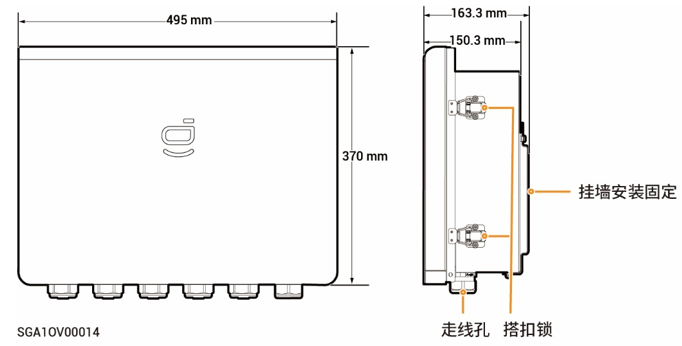
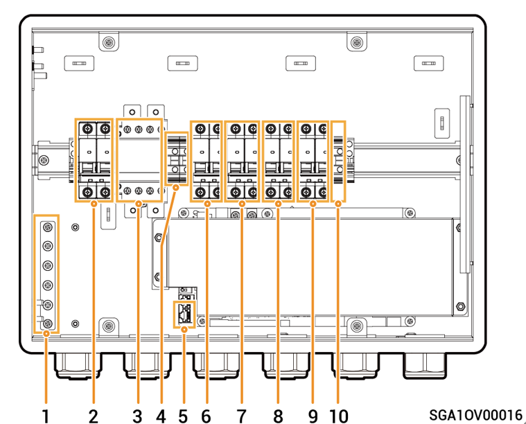

# Sigen Gateway Home SP 12K

### Dimensions

<figure><figcaption></figcaption></figure>

### Interior View

<figure><figcaption></figcaption></figure>

<table><thead><tr><th width="50" align="center">S/N</th><th width="100.25" align="center">Label</th><th width="531">Description</th></tr></thead><tbody><tr><td align="center"><strong>1</strong></td><td align="center">-</td><td>Grounding copper busbar</td></tr><tr><td align="center"><strong>2</strong></td><td align="center">QS1</td><td>Bypass switch</td></tr><tr><td align="center"><strong>3</strong></td><td align="center">KM1</td><td>Grid contactor</td></tr><tr><td align="center"><strong>4</strong></td><td align="center">X1</td><td>Terminal (connecting to a non-backup load)</td></tr><tr><td align="center"><strong>5</strong></td><td align="center">-</td><td>FE terminal</td></tr><tr><td align="center"><strong>6</strong></td><td align="center">QF1</td><td>Miniature circuit breaker (connecting to the power grid)</td></tr><tr><td align="center"><strong>7</strong></td><td align="center">QF2</td><td>Miniature circuit breaker (connecting to a single-phase inverter in a power range of 8.0 to 12.0 kW)</td></tr><tr><td align="center"><strong>8</strong></td><td align="center">QF3</td><td>Miniature circuit breaker (connecting to a household load)</td></tr><tr><td align="center"><strong>9</strong></td><td align="center">QF4</td><td>Miniature circuit breaker (connecting to a single-phase inverter in a power range of 3.0 to 6.0 kW)</td></tr><tr><td align="center"><strong>10</strong></td><td align="center">-</td><td>Terminal (connecting to functional ground cable)</td></tr></tbody></table>
