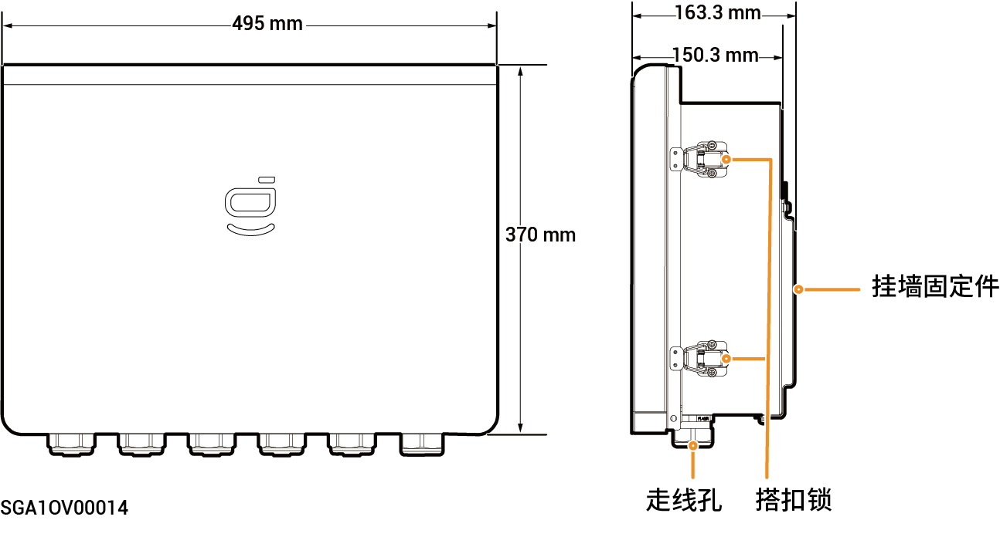

# Sigen Gateway Home SP 12K

### 尺寸图

<figure><figcaption></figcaption></figure>

### 内部图

<figure><figcaption></figcaption></figure>

<table><thead><tr><th width="100">序号</th><th>标签</th><th width="531">说明</th></tr></thead><tbody><tr><td><strong>1</strong></td><td>-</td><td>接地铜排</td></tr><tr><td><strong>2</strong></td><td>QS1</td><td>旁路开关</td></tr><tr><td><strong>3</strong></td><td>KM1</td><td>网侧接触器</td></tr><tr><td><strong>4</strong></td><td>X1</td><td>端子（连接非备电负载）</td></tr><tr><td><strong>5</strong></td><td>-</td><td>FE接口</td></tr><tr><td><strong>6</strong></td><td>QF1</td><td>微型断路器（连接电网）</td></tr><tr><td><strong>7</strong></td><td>QF2</td><td>微型断路器（连接单相逆变器，支持功率8.0-12.0kW）</td></tr><tr><td><strong>8</strong></td><td>QF3</td><td>微型断路器（连接备电家用负载）</td></tr><tr><td><strong>9</strong></td><td>QF4</td><td>微型断路器（连接单相逆变器，支持功率3.0-6.0kW）</td></tr><tr><td><strong>10</strong></td><td>-</td><td>端子（连接功能地线）</td></tr></tbody></table>
