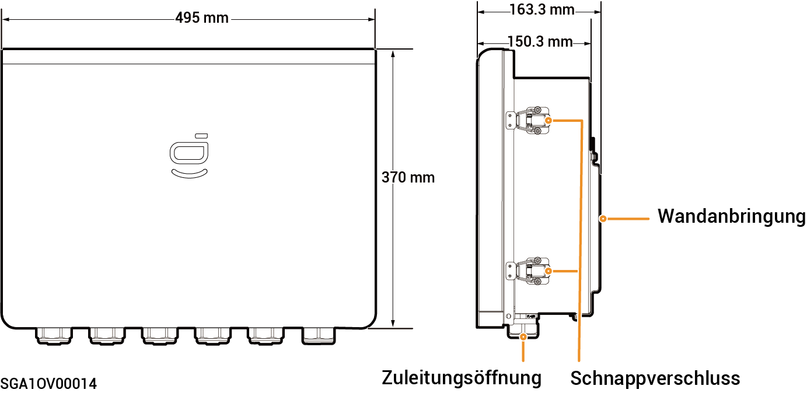

# Sigen Gateway Home SP 12K

### Abmessungen

<figure><figcaption></figcaption></figure>

### Innenansicht

<figure><figcaption></figcaption></figure>

<table><thead><tr><th width="82" align="center">Seriennr.</th><th>Beschriftung</th><th width="531">Beschreibung</th></tr></thead><tbody><tr><td align="center"><strong>1</strong></td><td>-</td><td>Erdungsschiene aus Kupfer</td></tr><tr><td align="center"><strong>2</strong></td><td>QS1</td><td>Umgehungsschalter</td></tr><tr><td align="center"><strong>3</strong></td><td>KM1</td><td>Netzschütz</td></tr><tr><td align="center"><strong>4</strong></td><td>X1</td><td>Klemme (Verbindung zu einer nicht gesicherten Last)</td></tr><tr><td align="center"><strong>5</strong></td><td>-</td><td>FE-Klemme</td></tr><tr><td align="center"><strong>6</strong></td><td>QF1</td><td>Kompaktleistungsschalter (Anschluss an den Netzstrom)</td></tr><tr><td align="center"><strong>7</strong></td><td>QF2</td><td>Kompaktleistungsschalter (Anschluss an einen einphasigen Wechselrichter im Leistungsbereich von 8,0 bis 12,0 kW)</td></tr><tr><td align="center"><strong>8</strong></td><td>QF3</td><td>Kompaktleistungsschalter (Anschluss an eine Haushaltslast)</td></tr><tr><td align="center"><strong>9</strong></td><td>QF4</td><td>Kompaktleistungsschalter (Anschluss an einen einphasigen Wechselrichter im Leistungsbereich von 3,0 bis 6,0 kW)</td></tr><tr><td align="center"><strong>10</strong></td><td>-</td><td>Klemme (Anschluss an ein Funktionserdungskabel)</td></tr></tbody></table>
