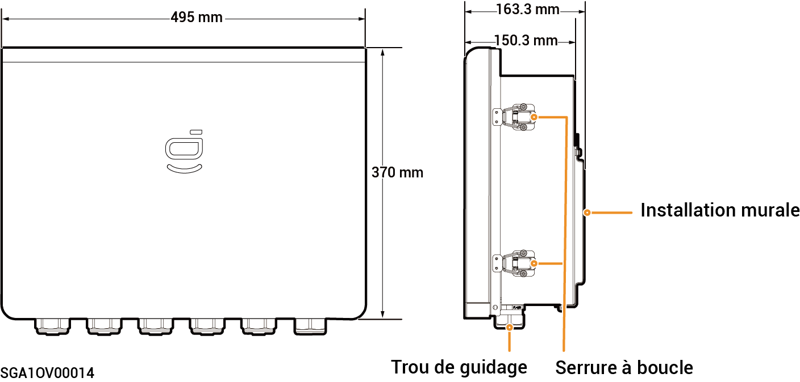
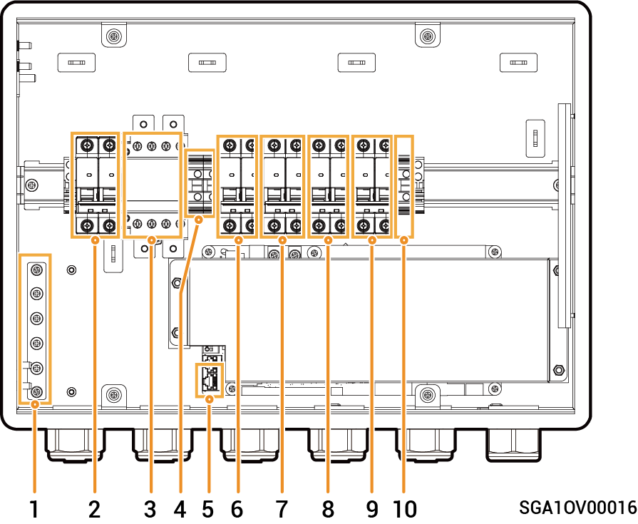

# Sigen Gateway Home SP 12K

### Dimensions

<figure><figcaption></figcaption></figure>

### Vue intérieure

<figure><figcaption></figcaption></figure>

<table><thead><tr><th width="82">N°</th><th>Étiquette</th><th width="531">Description</th></tr></thead><tbody><tr><td><strong>1</strong></td><td>-</td><td>Barre omnibus de mise à la terre en cuivre</td></tr><tr><td><strong>2</strong></td><td>QS1</td><td>Commutateur de dérivation</td></tr><tr><td><strong>3</strong></td><td>KM1</td><td>Contacteur de réseau</td></tr><tr><td><strong>4</strong></td><td>X1</td><td>Borne (connexion à une charge autre qu'une charge de secours)</td></tr><tr><td><strong>5</strong></td><td>-</td><td>Borne FE</td></tr><tr><td><strong>6</strong></td><td>QF1</td><td>Disjoncteur miniature (connexion au réseau électrique)</td></tr><tr><td><strong>7</strong></td><td>QF2</td><td>Disjoncteur miniature (connexion à un onduleur monophasé dont la plage de puissance est comprise entre 8,0 et 12,0 kW)</td></tr><tr><td><strong>8</strong></td><td>QF3</td><td>Disjoncteur miniature (connexion à un électroménager)</td></tr><tr><td><strong>9</strong></td><td>QF4</td><td>Disjoncteur miniature (connexion à un onduleur monophasé dont la plage de puissance est comprise entre 3,0 et 6,0 kW)</td></tr><tr><td><strong>10</strong></td><td>-</td><td>Borne (connexion du câble de mise à la terre fonctionnelle)</td></tr></tbody></table>
