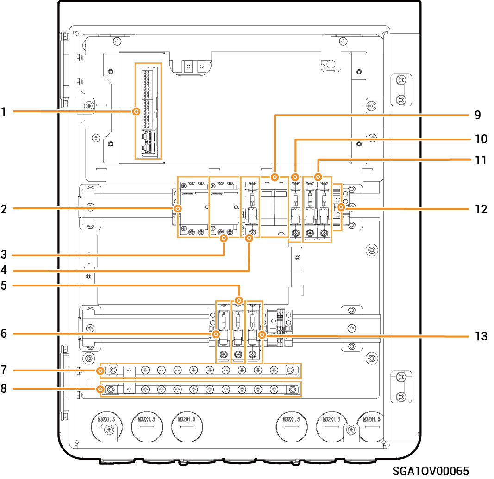

# Sigen Gateway Home SP AU

### Dimensions

<figure><figcaption></figcaption></figure>

### Interior View

<figure><figcaption></figcaption></figure>

<table><thead><tr><th width="75.5" align="center" valign="top">S/N</th><th width="101" valign="top">Label</th><th valign="top">Description</th></tr></thead><tbody><tr><td align="center" valign="top">1</td><td valign="top">-</td><td valign="top">Communication terminal (connecting to FE or DI communication cable)</td></tr><tr><td align="center" valign="top">2</td><td valign="top">KM2</td><td valign="top">Generator/smart loads contactor</td></tr><tr><td align="center" valign="top">3</td><td valign="top">KM1</td><td valign="top">Grid contactor</td></tr><tr><td align="center" valign="top">4</td><td valign="top">QS1</td><td valign="top">Bypass switch</td></tr><tr><td align="center" valign="top">5</td><td valign="top">QF4</td><td valign="top">Miniature circuit breaker (connecting to a single-phase inverter in a power range of 5.0 to 6.0 kW)</td></tr><tr><td align="center" valign="top">6</td><td valign="top">QF3</td><td valign="top">Miniature circuit breaker (connecting to a single-phase inverter in a power range of 8.0 to 10.0 kW)</td></tr><tr><td align="center" valign="top">7</td><td valign="top">N</td><td valign="top">N-line copper busbar</td></tr><tr><td align="center" valign="top">8</td><td valign="top">PE</td><td valign="top">Grounding copper busbar</td></tr><tr><td align="center" valign="top">9</td><td valign="top">FC1</td><td valign="top">Surge protective device</td></tr><tr><td align="center" valign="top">10</td><td valign="top">QF1</td><td valign="top">Miniature circuit breaker (connecting to the power grid)</td></tr><tr><td align="center" valign="top">11</td><td valign="top">QF2</td><td valign="top">Miniature circuit breaker (connecting to a generator/smart loads[1])</td></tr><tr><td align="center" valign="top">12</td><td valign="top">X1</td><td valign="top">Terminal (connecting to a non-backup load)</td></tr><tr><td align="center" valign="top">13</td><td valign="top">QF5</td><td valign="top">Miniature circuit breaker (connecting to a household load)</td></tr></tbody></table>

Note \[1]:

* All the power equipment in the owner's home can be connected as smart loads.
* To ensure that this product maximizes the benefits to users, it is recommended that the high-power equipment be connected as smart loads (third-party inverter, heat pumps, pool heaters, clothes dryers, immersion heaters, etc.), which can be cut off when the energy storage system has low power. Other low-power equipment are connected as household loads (lights, routers, etc.)
