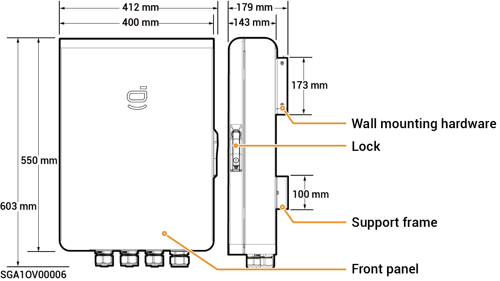

# Sigen Gateway Home SP

### Dimensions

<figure><figcaption></figcaption></figure>

### Bottom View

<figure><figcaption></figcaption></figure>

<table><thead><tr><th width="83">S/N</th><th width="148">Marking</th><th>Description</th></tr></thead><tbody><tr><td><strong>1</strong></td><td>GRID</td><td>Wire-in port of power grid</td></tr><tr><td><strong>2</strong></td><td>BACKUP</td><td>Wire-in port of backup Household loads</td></tr><tr><td><strong>3</strong></td><td>INV</td><td>Wire-in port of inverter</td></tr><tr><td><strong>4</strong></td><td>COM</td><td>Wire-in port of communication</td></tr></tbody></table>

### Interior View

<figure><figcaption></figcaption></figure>

<table><thead><tr><th width="76">S/N</th><th width="93">Label</th><th>Description</th></tr></thead><tbody><tr><td><strong>1</strong></td><td>-</td><td>Communication terminal (connecting to FE or DI communication cable)</td></tr><tr><td><strong>2</strong></td><td>QF30</td><td>Miniature circuit breaker (connecting to Inverter)</td></tr><tr><td><strong>3</strong></td><td>GND</td><td>GND</td></tr><tr><td><strong>4</strong></td><td>-</td><td>Cable clamp</td></tr><tr><td><strong>5</strong></td><td>-</td><td>Grounding Bar</td></tr><tr><td><strong>6</strong></td><td>QF10</td><td>Miniature circuit breaker (connecting to Power grid)</td></tr><tr><td><strong>7</strong></td><td>QF50</td><td>Miniature circuit breaker (connecting to Backup Household loads)</td></tr></tbody></table>
