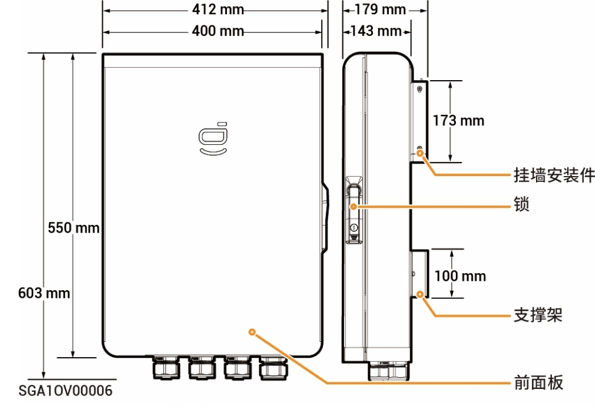
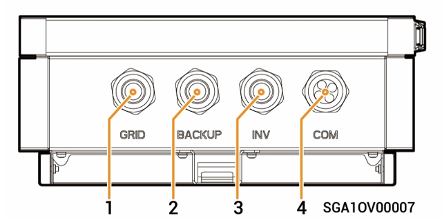
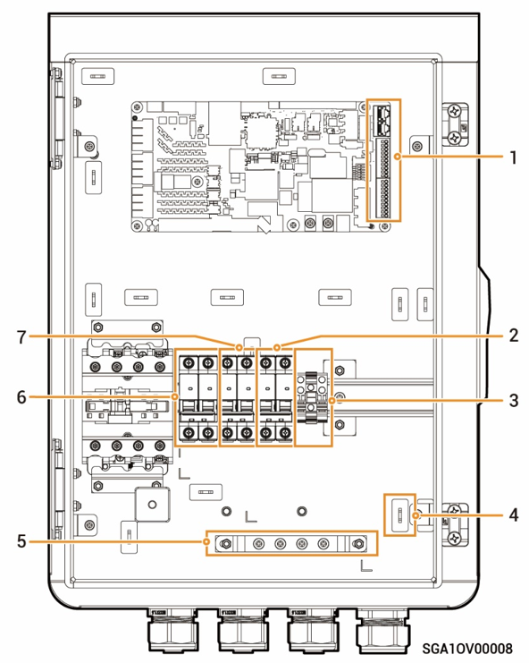

# Sigen Gateway Home SP

### 尺寸图

<figure><figcaption></figcaption></figure>

### 底视图

<figure><figcaption></figcaption></figure>

| 序号    | 丝印     | 说明        |
| ----- | ------ | --------- |
| **1** | GRID   | 电网进线口     |
| **2** | BACKUP | 备电家用负载进线口 |
| **3** | INV    | 逆变器进线口    |
| **4** | COM    | 通信进线口     |

### 内部图

<figure><figcaption></figcaption></figure>

<table><thead><tr><th width="76">序号</th><th width="93">标签</th><th>说明</th></tr></thead><tbody><tr><td><strong>1</strong></td><td>-</td><td>通讯端口（连接FE、DI等通讯线）</td></tr><tr><td><strong>2</strong></td><td>QF30</td><td>微型断路器（逆变器）</td></tr><tr><td><strong>3</strong></td><td>GND</td><td>GND端子</td></tr><tr><td><strong>4</strong></td><td>-</td><td>扎线扣</td></tr><tr><td><strong>5</strong></td><td>-</td><td>接地排</td></tr><tr><td><strong>6</strong></td><td>QF10</td><td>微型断路器（电网）</td></tr><tr><td><strong>7</strong></td><td>QF50</td><td>微型断路器（备电家用负载）</td></tr></tbody></table>
