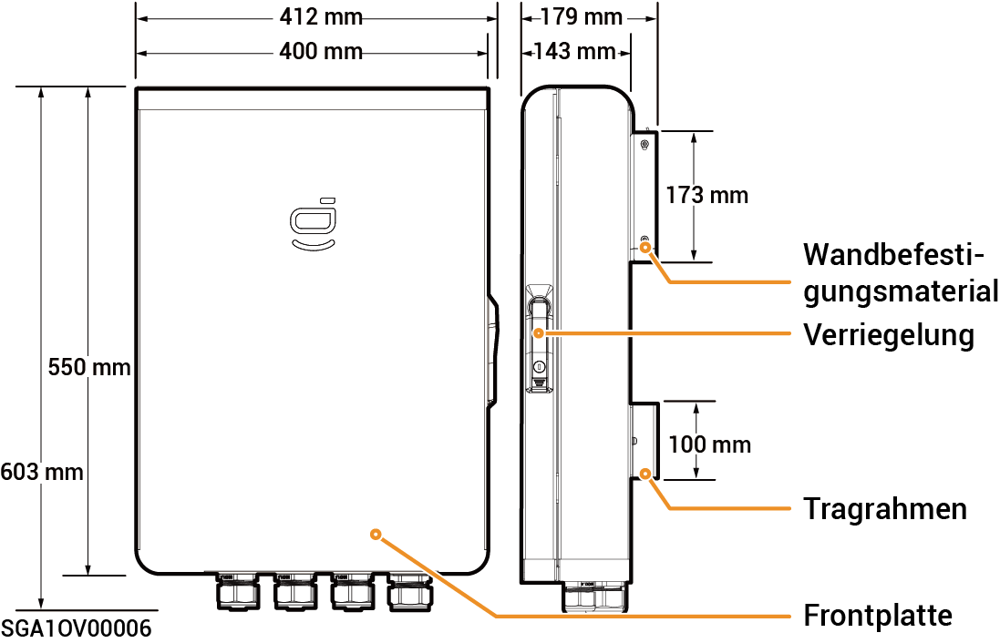

# Sigen Gateway Home SP

### Abmessungen

<figure><figcaption></figcaption></figure>

### Ansicht von unten

<figure><figcaption></figcaption></figure>

<table><thead><tr><th width="83" align="center">Seriennr.</th><th width="148">Kennzeichnung</th><th>Beschreibung</th></tr></thead><tbody><tr><td align="center"><strong>1</strong></td><td>GRID</td><td>Verdrahtungsanschluss für Stromnetz</td></tr><tr><td align="center"><strong>2</strong></td><td>BACKUP</td><td>Verdrahtungsanschluss für Notstrom-Haushaltslasten</td></tr><tr><td align="center"><strong>3</strong></td><td>INV</td><td>Verdrahtungsanschluss für Wechselrichter</td></tr><tr><td align="center"><strong>4</strong></td><td>COM</td><td>Verdrahtungsanschluss für Kommunikation</td></tr></tbody></table>

### Innenansicht

<figure><figcaption></figcaption></figure>

<table><thead><tr><th width="76">Seriennr.</th><th width="93">Beschriftung</th><th>Beschreibung</th></tr></thead><tbody><tr><td><strong>1</strong></td><td>-</td><td>Kommunikationsklemme (Anschluss an FE oder DI-Kommunikationskabel)</td></tr><tr><td><strong>2</strong></td><td>QF30</td><td>Kompaktleistungsschalter (Anschluss an Wechselrichter)</td></tr><tr><td><strong>3</strong></td><td>GND</td><td>GND</td></tr><tr><td><strong>4</strong></td><td>-</td><td>Kabelklemme</td></tr><tr><td><strong>5</strong></td><td>-</td><td>Erdungsschiene</td></tr><tr><td><strong>6</strong></td><td>QF10</td><td>Kompaktleistungsschalter (Anschluss an Stromnetz)</td></tr><tr><td><strong>7</strong></td><td>QF50</td><td>Kompaktleistungsschalter (Anschluss an Notstrom-Haushaltslasten)</td></tr></tbody></table>
