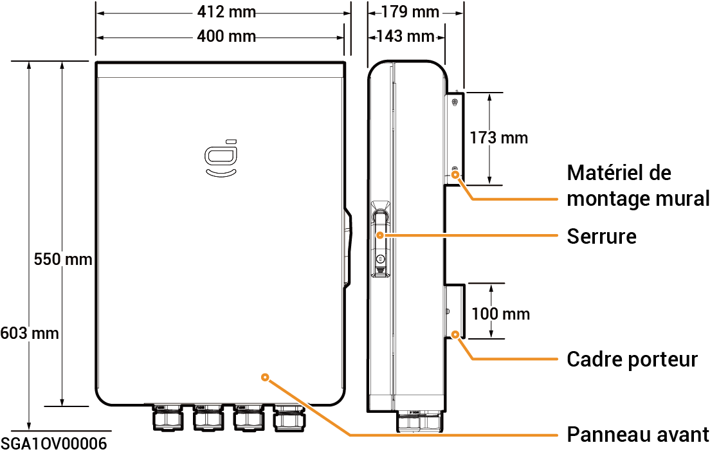

# Sigen Gateway Home SP

### Dimensions

<figure><figcaption></figcaption></figure>

### Vue de dessous

<figure><figcaption></figcaption></figure>

<table><thead><tr><th width="83">N°</th><th width="148">Marquage</th><th>Description</th></tr></thead><tbody><tr><td><strong>1</strong></td><td>GRID</td><td>Port d'entrée du réseau électrique</td></tr><tr><td><strong>2</strong></td><td>BACKUP</td><td>Port d'entrée du circuit de secours pour électroménager</td></tr><tr><td><strong>3</strong></td><td>INV</td><td>Port d'entrée de l'onduleur</td></tr><tr><td><strong>4</strong></td><td>COM</td><td>Port d'entrée de communication</td></tr></tbody></table>

### Vue intérieure

<figure><figcaption></figcaption></figure>

<table><thead><tr><th width="76">N°</th><th width="93">Étiquette</th><th>Description</th></tr></thead><tbody><tr><td><strong>1</strong></td><td>-</td><td>Borne de communication (connexion à un câble de communication FE ou DI)</td></tr><tr><td><strong>2</strong></td><td>QF30</td><td>Disjoncteur miniature (connexion à un onduleur)</td></tr><tr><td><strong>3</strong></td><td>GND</td><td>GND</td></tr><tr><td><strong>4</strong></td><td>-</td><td>Serre-câble</td></tr><tr><td><strong>5</strong></td><td>-</td><td>Barre de mise à la terre</td></tr><tr><td><strong>6</strong></td><td>QF10</td><td>Disjoncteur miniature (connexion au réseau électrique)</td></tr><tr><td><strong>7</strong></td><td>QF50</td><td>Disjoncteur miniature (connexion au circuit de secours pour électroménager)</td></tr></tbody></table>
