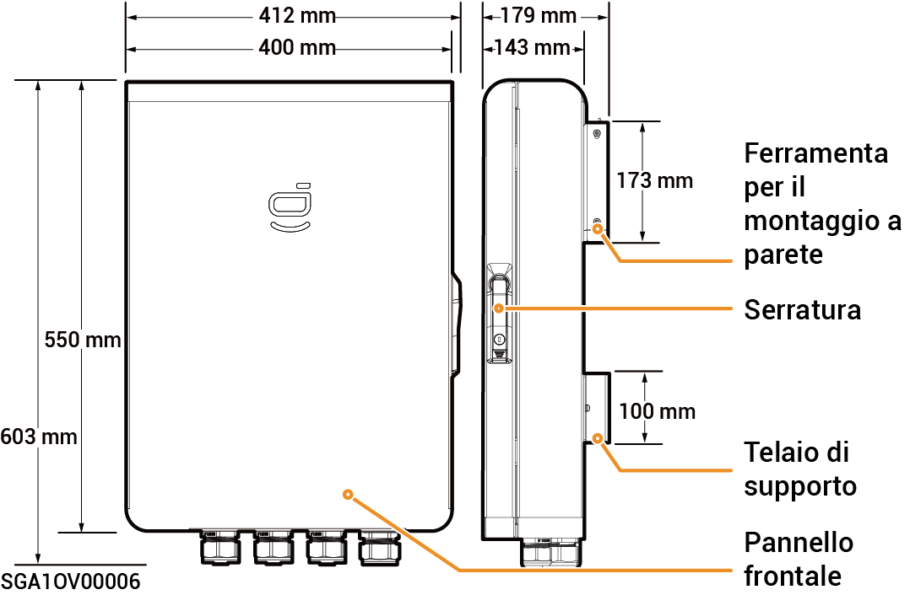
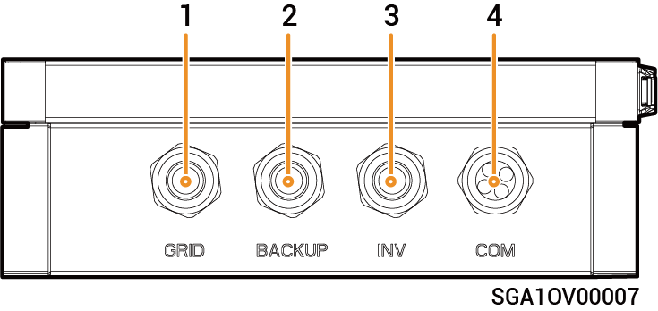
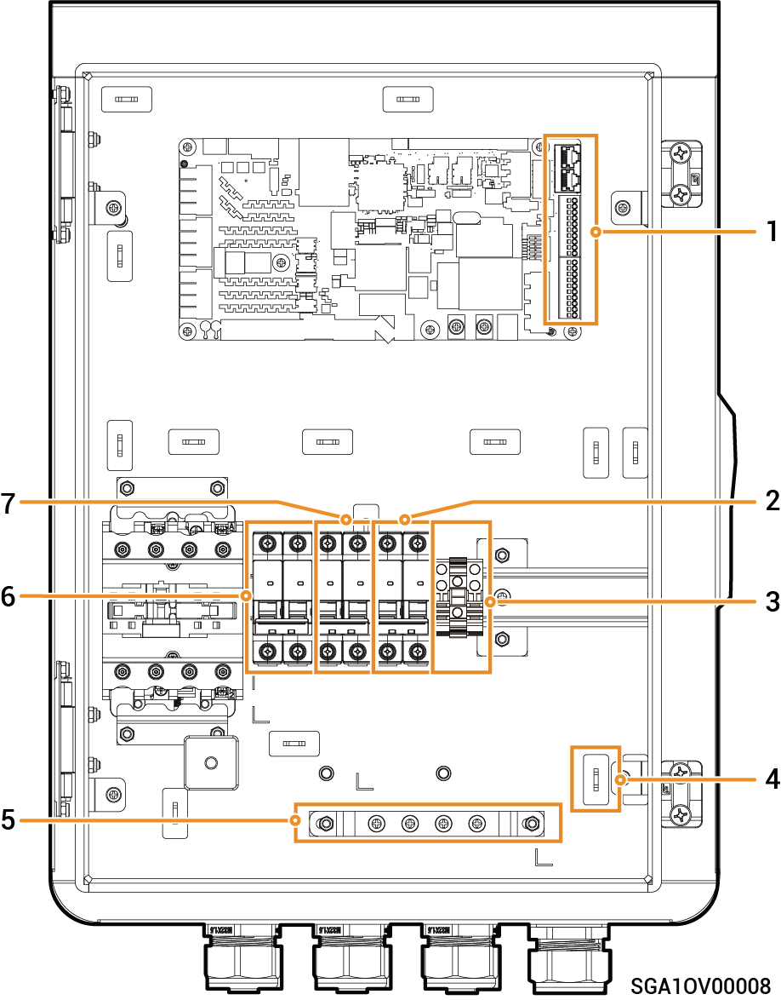

# Sigen Gateway Home SP

### Dimensioni

<figure><figcaption></figcaption></figure>

### Vista dal basso

<figure><figcaption></figcaption></figure>

<table><thead><tr><th width="83">N.</th><th width="148">Indicazione</th><th>Descrizione</th></tr></thead><tbody><tr><td><strong>1</strong></td><td>GRID</td><td>Porta di ingresso cablata della rete elettrica</td></tr><tr><td><strong>2</strong></td><td>BACKUP</td><td>Porta di ingresso cablata dei carichi domestici che necessitano del backup</td></tr><tr><td><strong>3</strong></td><td>INV</td><td>Porta di ingresso cablata dell'inverter</td></tr><tr><td><strong>4</strong></td><td>COM</td><td>Porta di ingresso cablata di comunicazione</td></tr></tbody></table>

### Vista interna

<figure><figcaption></figcaption></figure>

<table><thead><tr><th width="76">N.</th><th width="93">Etichetta</th><th>Descrizione</th></tr></thead><tbody><tr><td><strong>1</strong></td><td>-</td><td>Terminale di comunicazione (collegato al cavo di comunicazione FE o DI)</td></tr><tr><td><strong>2</strong></td><td>QF30</td><td>Interruttore automatico in miniatura (collegato all'inverter)</td></tr><tr><td><strong>3</strong></td><td>GND</td><td>GND</td></tr><tr><td><strong>4</strong></td><td>-</td><td>Fermacavo</td></tr><tr><td><strong>5</strong></td><td>-</td><td>Barra di messa a terra</td></tr><tr><td><strong>6</strong></td><td>QF10</td><td>Interruttore automatico in miniatura (collegato alla rete)</td></tr><tr><td><strong>7</strong></td><td>QF50</td><td>Interruttore automatico in miniatura (collegato ai carichi domestici che necessitano del backup)</td></tr></tbody></table>
