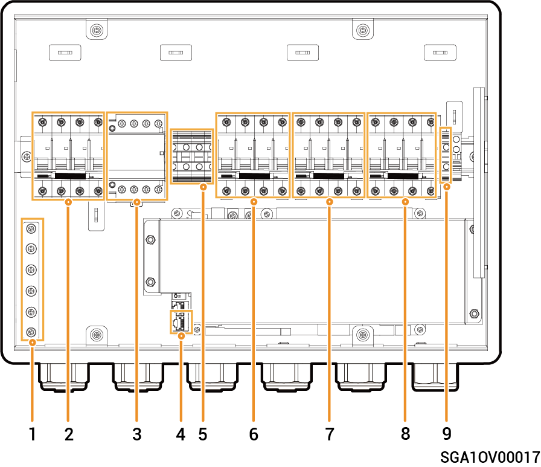

# Sigen Gateway Home TP (30K, 30K CN)

### Abmessungen

<figure><figcaption></figcaption></figure>

### Innenansicht

<figure><figcaption></figcaption></figure>

<table><thead><tr><th width="147">Seriennr.</th><th width="117">Beschriftung</th><th width="482">Beschreibung</th></tr></thead><tbody><tr><td><strong>1</strong></td><td>-</td><td>Erdungsschiene aus Kupfer</td></tr><tr><td><strong>2</strong></td><td>QS1</td><td>Umgehungsschalter</td></tr><tr><td><strong>3</strong></td><td>KM1</td><td>Netzschütz</td></tr><tr><td><strong>4</strong></td><td>-</td><td>FE-Klemme</td></tr><tr><td><strong>5</strong></td><td>X1</td><td>Klemme (Verbindung zu einer nicht gesicherten Last)</td></tr><tr><td><strong>6</strong></td><td>QF1</td><td>Kompaktleistungsschalter (Anschluss an den Netzstrom)</td></tr><tr><td><strong>7</strong></td><td>QF2</td><td>Kompaktleistungsschalter (Anschluss an einen dreiphasigen Wechselrichter)</td></tr><tr><td><strong>8</strong></td><td>QF3</td><td>Kompaktleistungsschalter (Anschluss an eine Haushaltslast)</td></tr><tr><td><strong>9</strong></td><td>-</td><td>Klemme (Anschluss an ein Funktionserdungskabel)</td></tr></tbody></table>
