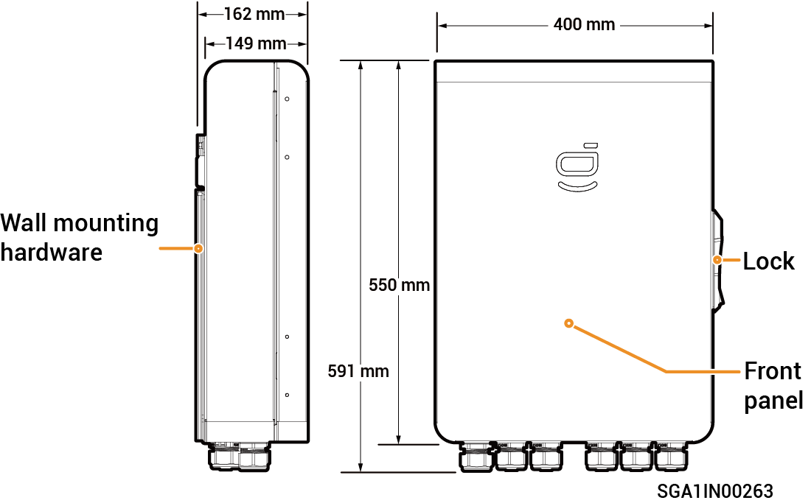
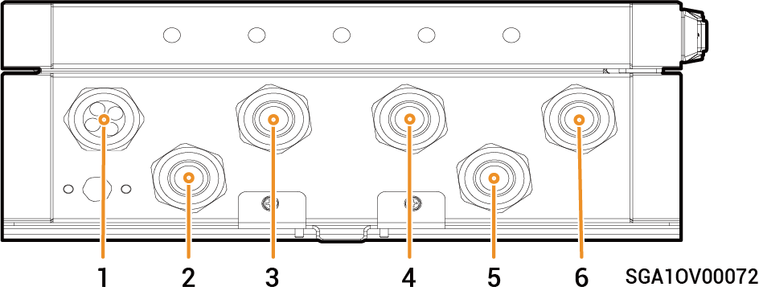
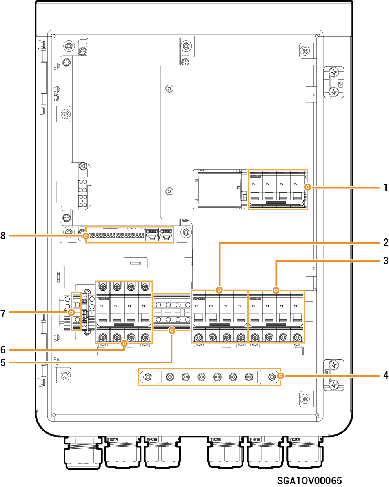

# Sigen Gateway Home TP (30K, 30K CN)

### Dimensions

<figure><figcaption></figcaption></figure>

### Interior View

<figure><figcaption></figcaption></figure>

| S/N | Name                                  |
| --- | ------------------------------------- |
| 1   | Wire-in port of communication         |
| 2   | Wire-in port of power grid            |
| 3   | Wire-in port of non-backup load       |
| 4   | Wire-in port of inverter              |
| 5   | Reserved                              |
| 6   | Wire-in port of backup household load |

### Interior View

<figure><figcaption></figcaption></figure>

<table><thead><tr><th width="126.60009765625">No.</th><th width="128.4000244140625">Label</th><th>Description</th></tr></thead><tbody><tr><td>1</td><td>QS1</td><td>bypass switch</td></tr><tr><td>2</td><td>QF2</td><td>Miniature circuit breaker (connecting to a three-phase inverter)</td></tr><tr><td>3</td><td>QF3</td><td>Miniature circuit breaker (connecting to a backup household load)</td></tr><tr><td>4</td><td></td><td>Grounding copper busbar</td></tr><tr><td>5</td><td>X1</td><td>Terminal (connecting to a non-backup load)</td></tr><tr><td>6</td><td>QF1</td><td>Miniature circuit breaker (connecting to the power grid)</td></tr><tr><td>7</td><td>GND</td><td>Terminal (connecting to functional ground cable)</td></tr><tr><td>8</td><td>–</td><td>
Communication terminal

(connecting to FE, DI, DO communication cable)
</td></tr></tbody></table>
