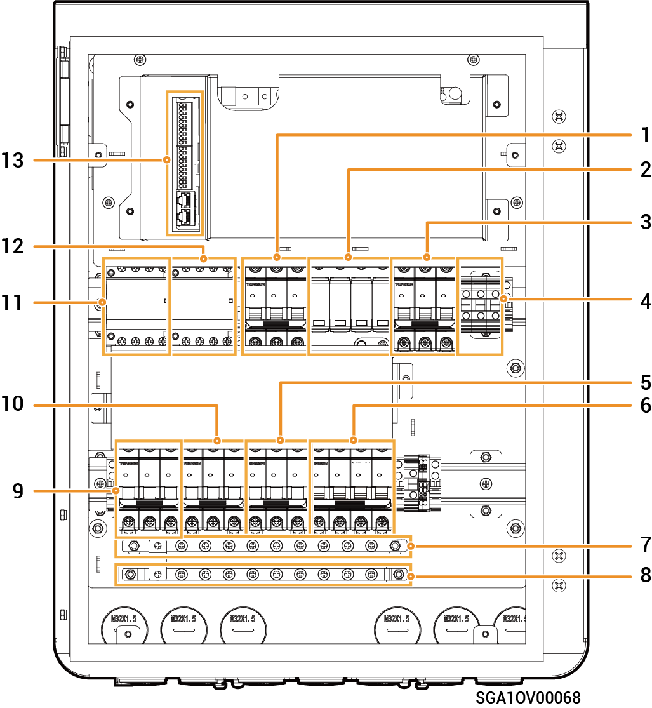

# Sigen Gateway Home TP AU

### Mitat

<figure><figcaption></figcaption></figure>

### Sisänäkymä

<figure><figcaption></figcaption></figure>

<table><thead><tr><th width="85.5" align="center" valign="top">S/N</th><th width="105.25" valign="top">Tarra</th><th valign="top">Kuvaus</th></tr></thead><tbody><tr><td align="center" valign="top">1</td><td valign="top">QS1</td><td valign="top">Ohituskytkin</td></tr><tr><td align="center" valign="top">2</td><td valign="top">FC1</td><td valign="top">Ylij&auml;nnitesuojalaite</td></tr><tr><td align="center" valign="top">3</td><td valign="top">QF1</td><td valign="top">Pienkatkaisija (liitetty s&auml;hk&ouml;verkkoon)</td></tr><tr><td align="center" valign="top">4</td><td valign="top">X1</td><td valign="top">Pienkatkaisija (liitetty ei-varavoimalla toimivaan kotitalouskuormaan)</td></tr><tr><td align="center" valign="top">5</td><td valign="top">QF5</td><td valign="top">Pienkatkaisija (liitetty varavoimalla toimivaan kotitalouskuormaan)</td></tr><tr><td align="center" valign="top">6</td><td valign="top">QF2</td><td valign="top">Pienkatkaisija (liitetty generaattoriin / &auml;lykk&auml;&auml;seen kuormaan[1])</td></tr><tr><td align="center" valign="top">7</td><td valign="top">N</td><td valign="top">N-linjan kuparikisko</td></tr><tr><td align="center" valign="top">8</td><td valign="top">PE</td><td valign="top">Kuparinen maadoituskisko</td></tr><tr><td align="center" valign="top">9</td><td valign="top">QF3</td><td valign="top">Pienkatkaisija (liitetty invertteriin1)</td></tr><tr><td align="center" valign="top">10</td><td valign="top">QF4</td><td valign="top">Pienkatkaisija (liitetty invertteriin 2)</td></tr><tr><td align="center" valign="top">11</td><td valign="top">KM2</td><td valign="top">Generaattorin kontaktori</td></tr><tr><td align="center" valign="top">12</td><td valign="top">KM1</td><td valign="top">Verkkokontaktori</td></tr><tr><td align="center" valign="top">13</td><td valign="top">-</td><td valign="top">Viestint&auml;p&auml;&auml;te (liitetty FE- tai DI-viestint&auml;kaapeliin)</td></tr></tbody></table>

Huomaa [1]:

* Kaikki kodin sähkölaitteet voidaan kytkeä älykkäinä kuormina.
* Jotta tämä tuote tarjoaisi käyttäjille mahdollisimman suuren hyödyn, on suositeltavaa kytkeä suuritehoiset laitteet älykkäiksi kuormiksi (kolmannen osapuolen invertteri, lämpöpumput, uima-altaan lämmittimet, kuivausrummut, uppolämmityslaitteet jne.), jotka voidaan katkaista, kun energian varastointijärjestelmän teho on alhainen. Muut pienitehoiset laitteet kytketään kotitalouskuormana (valaisimet, reitittimet jne.)
