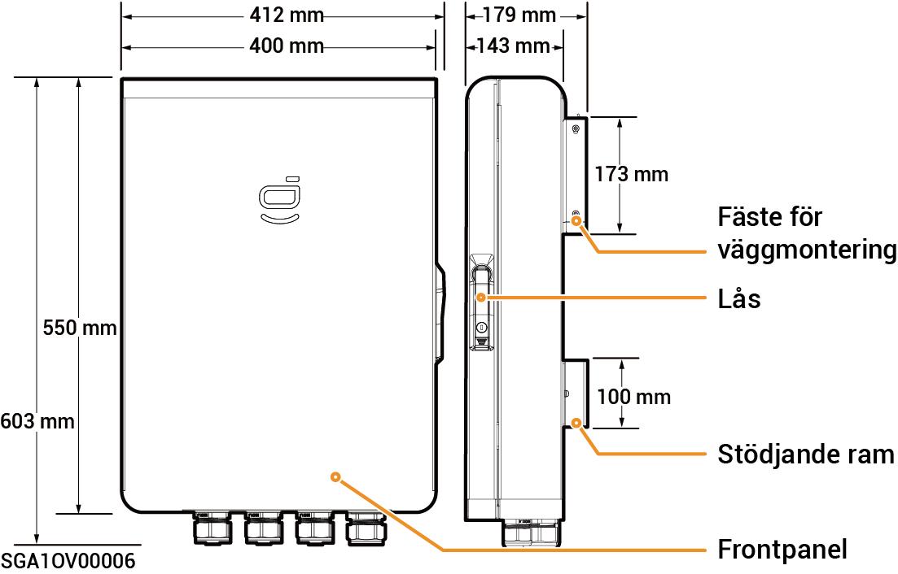
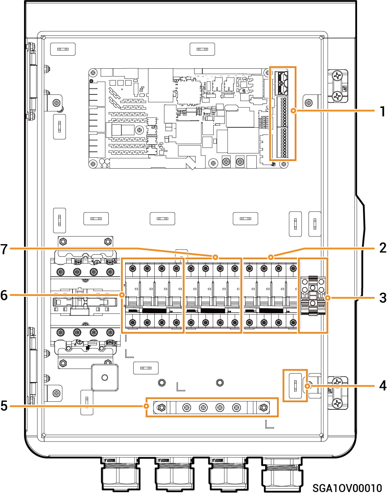

# Sigen Gateway Home TP

### Mått

<figure><figcaption></figcaption></figure>

### Sedd underifrån

<figure><figcaption></figcaption></figure>

<table><thead><tr><th width="100">Siffra</th><th width="126">Märkning</th><th>Beskrivning</th></tr></thead><tbody><tr><td>1</td><td>GRID</td><td>Ingång för elnätet</td></tr><tr><td>2</td><td>BACKUP</td><td>Ingång för hushållets reservlaster</td></tr><tr><td>3</td><td>INV</td><td>Ingång för växelriktare</td></tr><tr><td>4</td><td>COM</td><td>Ingång för kommunikation</td></tr></tbody></table>

### Sedd inifrån

<figure><figcaption></figcaption></figure>

<table><thead><tr><th width="95">Siffra</th><th width="78">Etikett</th><th>Beskrivning</th></tr></thead><tbody><tr><td><strong>1</strong></td><td>-</td><td>Kommunikationsplint (ansluten till FE- eller DI-kommunikationskabel)</td></tr><tr><td><strong>2</strong></td><td>QF30</td><td>Minikretsbrytare (ansluten till växelriktare)</td></tr><tr><td><strong>3</strong></td><td>JORD</td><td>JORD</td></tr><tr><td><strong>4</strong></td><td>-</td><td>Kabelklämma</td></tr><tr><td><strong>5</strong></td><td>-</td><td>Jordskena</td></tr><tr><td><strong>6</strong></td><td>QF10</td><td>Minikretsbrytare (ansluten till elnätet)</td></tr><tr><td><strong>7</strong></td><td>QF50</td><td>Minikretsbrytare (ansluten till hushållets reservlaster)</td></tr></tbody></table>
