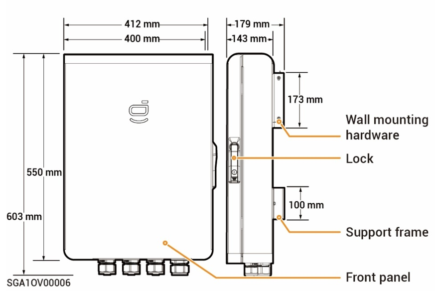
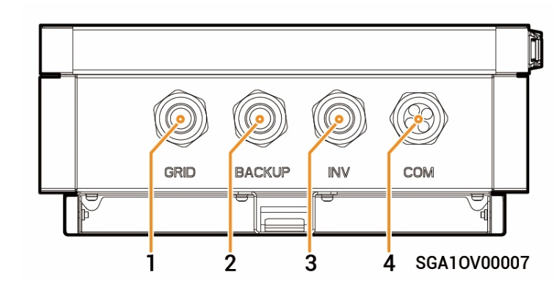
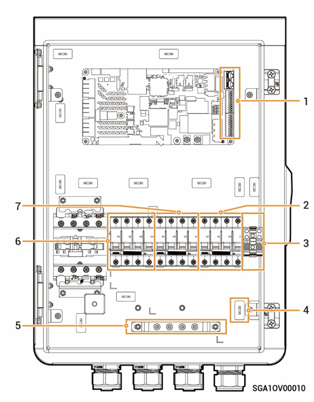

# Sigen Gateway Home TP

### Dimensions

<figure><figcaption></figcaption></figure>

### Bottom View

<figure><figcaption></figcaption></figure>

| S/N   | Marking | Description                            |
| ----- | ------- | -------------------------------------- |
| **1** | GRID    | Wire-in port of power grid             |
| **2** | BACKUP  | Wire-in port of Backup Household loads |
| **3** | INV     | Wire-in port of inverter               |
| **4** | COM     | Wire-in port of communication          |

### Interior View

<figure><figcaption></figcaption></figure>

<table><thead><tr><th width="95">S/N</th><th width="78">Label</th><th>Description</th></tr></thead><tbody><tr><td><strong>1</strong></td><td>-</td><td>Communication terminal (connecting to FE or DI communication cable)</td></tr><tr><td><strong>2</strong></td><td>QF30</td><td>Miniature circuit breaker (connecting to Inverter)</td></tr><tr><td><strong>3</strong></td><td>GND</td><td>GND</td></tr><tr><td><strong>4</strong></td><td>-</td><td>Cable clamp</td></tr><tr><td><strong>5</strong></td><td>-</td><td>Grounding bar</td></tr><tr><td><strong>6</strong></td><td>QF10</td><td>Miniature circuit breaker (connecting to Power grid)</td></tr><tr><td><strong>7</strong></td><td>QF50</td><td>Miniature circuit breaker (connecting to Backup Household loads)</td></tr></tbody></table>
