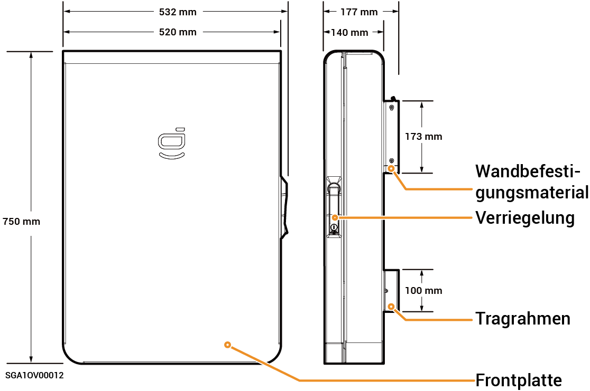

# Sigen Gateway HomeMax SP LA

### Dimensions

<figure><figcaption></figcaption></figure>

### Innenansicht

<figure><figcaption></figcaption></figure>

<table><thead><tr><th width="88.66668701171875" align="center" valign="middle">Seriennr.</th><th valign="top">Beschreibung</th></tr></thead><tbody><tr><td align="center" valign="middle">1</td><td valign="top">FE-Klemme</td></tr><tr><td align="center" valign="middle">2</td><td valign="top">
Mounting location of circuit breaker

(connecting to Backup household loads)
</td></tr><tr><td align="center" valign="middle">3</td><td valign="top">
Mounting location of circuit breaker

(connecting to Power grid)
</td></tr><tr><td align="center" valign="middle">4</td><td valign="top">Grounding bar</td></tr><tr><td align="center" valign="middle">5</td><td valign="top">N-bar</td></tr><tr><td align="center" valign="middle">6</td><td valign="top">DI,DO interface</td></tr><tr><td align="center" valign="middle">7</td><td valign="top">
Mounting location of circuit breaker

(connecting to Inverters 1, 2)
</td></tr><tr><td align="center" valign="middle">8</td><td valign="top">
Mounting location of circuit breaker

(connecting to Generator)
</td></tr><tr><td align="center" valign="middle">9</td><td valign="top">Mounting location of circuit breaker (connecting to Smart loads 1, 2, 3, 4, 5) [1]</td></tr></tbody></table>

Hinweis \[1]:

* Alle Stromgeräte im Heim des Eigentümers können als intelligente Verbraucher angeschlossen werden.
* Um sicherzustellen, dass dieses Produkt den Benutzern maximale Vorteile bietet, wird empfohlen, die Hochleistungsgeräte als intelligente Verbraucher anzuschließen (Wärmepumpen, Schwimmbadheizungen, Wäschetrockner, Tauchsieder usw.), die abgeschaltet werden können, wenn die Leistung des Energiespeichersystems schwach ist. Andere Geräte mit niedrigem Leistungsbedarf sind als Haushaltslasten (Lampen, Router usw.) angeschlossen.
