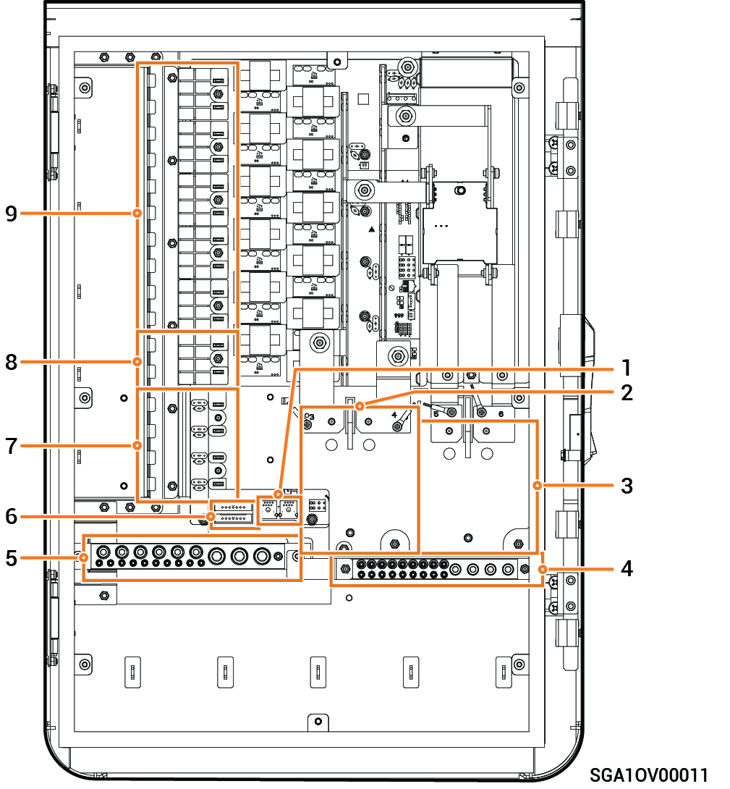

# Sigen Gateway HomeMax SP LA

### 尺寸图

<figure><figcaption></figcaption></figure>

### 内部图

<figure><figcaption></figcaption></figure>

<table><thead><tr><th width="71.33331298828125" align="center" valign="top">序号</th><th valign="top">说明</th></tr></thead><tbody><tr><td align="center" valign="top">1</td><td valign="top">FE 接口</td></tr><tr><td align="center" valign="top">2</td><td valign="top">断路器安装位置（连接备电家用负载）</td></tr><tr><td align="center" valign="top">3</td><td valign="top">断路器安装位置（连接电网）</td></tr><tr><td align="center" valign="top">4</td><td valign="top">接地排</td></tr><tr><td align="center" valign="top">5</td><td valign="top">N 排</td></tr><tr><td align="center" valign="top">6</td><td valign="top">DI、DO 接口</td></tr><tr><td align="center" valign="top">7</td><td valign="top">断路器安装位置（连接逆变器1、2）</td></tr><tr><td align="center" valign="top">8</td><td valign="top">断路器安装位置（连接发电机）</td></tr><tr><td align="center" valign="top">9</td><td valign="top">断路器安装位置（连接智能负载1、2、3、4、5）【1】</td></tr></tbody></table>

注【1】：

* 业主家中的用电设备均可作为智能负载接入。
* 为保证本产品对用户利益最大化，建议大功率设备作为智能负载接入（如第三方逆变器、热泵、泳池加热器、干衣机、热得快等），当储能电量不足时可切出。其他小功率设备作为家用负载接入（如灯、路由器等）
