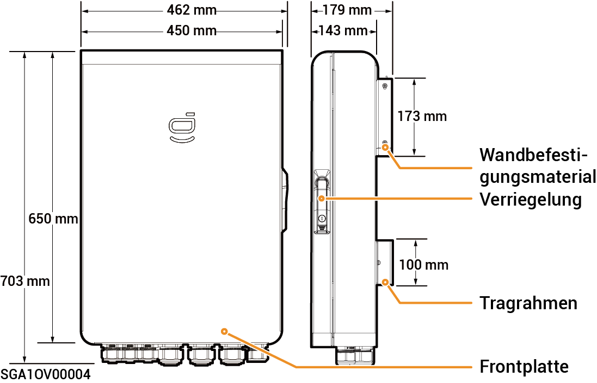

# Sigen Gateway HomeMax SP

### Abmessungen

<figure><figcaption></figcaption></figure>

### Ansicht von unten

<figure><figcaption></figcaption></figure>

<table><thead><tr><th width="96" align="center">Seriennr.</th><th width="156">Kennzeichnung</th><th>Beschreibung</th></tr></thead><tbody><tr><td align="center"><strong>1</strong></td><td>INV1</td><td>Verdrahtungsanschluss für Wechselrichter 1</td></tr><tr><td align="center"><strong>2</strong></td><td>INV2</td><td>Verdrahtungsanschluss für Wechselrichter 2</td></tr><tr><td align="center"><strong>3</strong></td><td>INV3</td><td>Verdrahtungsanschluss für Wechselrichter 3</td></tr><tr><td align="center"><strong>4</strong></td><td>BACKUP</td><td>Verdrahtungsanschluss für Notstrom-Haushaltslasten</td></tr><tr><td align="center"><strong>5</strong></td><td>SMART-PORT</td><td>Verkabelungsanschluss für intelligente Verbraucher/Generator</td></tr><tr><td align="center"><strong>6</strong></td><td>GRID</td><td>Verdrahtungsanschluss für Stromnetz</td></tr><tr><td align="center"><strong>7</strong></td><td>COM</td><td>Verdrahtungsanschluss für Kommunikation</td></tr></tbody></table>

### Innenansicht

<figure><figcaption></figcaption></figure>

<table><thead><tr><th width="92" align="center">Seriennr.</th><th width="157">Beschriftung</th><th>Beschreibung</th></tr></thead><tbody><tr><td align="center"><strong>1</strong></td><td>-</td><td>Kommunikationsklemme (Anschluss an FE oder DI-Kommunikationskabel)</td></tr><tr><td align="center"><strong>2</strong></td><td>QF2</td><td>Kompaktleistungsschalter (Anschluss an intelligente Verbraucher[1]/Generator)</td></tr><tr><td align="center"><strong>3</strong></td><td>QF1</td><td>Kompaktleistungsschalter (Anschluss an Stromnetz)</td></tr><tr><td align="center"><strong>4</strong></td><td>QF6</td><td>Kompaktleistungsschalter (Anschluss an Notstrom-Haushaltslasten)</td></tr><tr><td align="center"><strong>5</strong></td><td>QF8</td><td>Überspannungsschutz-Geräteschalter</td></tr><tr><td align="center"><strong>6</strong></td><td>GND</td><td>GND</td></tr><tr><td align="center"><strong>7</strong></td><td>-</td><td>Kabelklemme</td></tr><tr><td align="center"><strong>8</strong></td><td>-</td><td>Erdungsschiene</td></tr><tr><td align="center"><strong>9</strong></td><td>QF3, QF4, QF5</td><td>Kompaktleistungsschalter (Anschluss an Wechselrichter 1, 2, 3)</td></tr></tbody></table>

Hinweis \[1]:

* Alle Stromgeräte im Heim des Eigentümers können als intelligente Verbraucher angeschlossen werden.
* Um sicherzustellen, dass dieses Produkt den Benutzern maximale Vorteile bietet, wird empfohlen, die Hochleistungsgeräte als intelligente Verbraucher anzuschließen (Wärmepumpen, Schwimmbadheizungen, Wäschetrockner, Tauchsieder usw.), die abgeschaltet werden können, wenn die Leistung des Energiespeichersystems schwach ist. Andere Geräte mit niedrigem Leistungsbedarf sind als Haushaltslasten (Lampen, Router usw.) angeschlossen.
