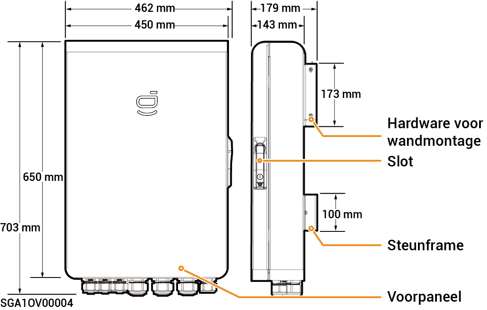

# Sigen Gateway HomeMax SP

### Dimensies

<figure><figcaption></figcaption></figure>

### Onderaanzicht

<figure><figcaption></figcaption></figure>

<table><thead><tr><th width="96">S/N</th><th width="156">Markering</th><th>Beschrijving</th></tr></thead><tbody><tr><td><strong>1</strong></td><td>INV1</td><td>Draadingangspoort van omvormer 1</td></tr><tr><td><strong>2</strong></td><td>INV2</td><td>Draadingangspoort van omvormer 2</td></tr><tr><td><strong>3</strong></td><td>INV3</td><td>Aansluitpoort van omvormer 3</td></tr><tr><td><strong>4</strong></td><td>BACK-UP</td><td>Aansluitpoort voor back-up huishoudelijke belasting</td></tr><tr><td><strong>5</strong></td><td>SLIMME POORT</td><td>Aansluitpoort voor slimme belasting/generator</td></tr><tr><td><strong>6</strong></td><td>GRID</td><td>Draadingangspoort van het elektriciteitsnet</td></tr><tr><td><strong>7</strong></td><td>COM</td><td>
Aansluitpoort van

communicatie
</td></tr></tbody></table>

### Binnenaanzicht

<figure><figcaption></figcaption></figure>

<table><thead><tr><th width="92">S/N</th><th width="157">Label</th><th>Beschrijving</th></tr></thead><tbody><tr><td><strong>1</strong></td><td>-</td><td>Communicatieterminal (aansluiten op FE- of DI-communicatiekabel)</td></tr><tr><td><strong>2</strong></td><td>QF2</td><td>Miniatuur stroomonderbreker (verbinden met slimme belasting [1]/generator)</td></tr><tr><td><strong>3</strong></td><td>QF1</td><td>Miniatuur stroomonderbreker (verbinden met elektriciteitsnet)</td></tr><tr><td><strong>4</strong></td><td>QF6</td><td>Miniatuur stroomonderbreker (verbinden met back-up huishoudelijke belasting)</td></tr><tr><td><strong>5</strong></td><td>QF8</td><td>Schakelaar overspanningsbeveiligingsapparaat</td></tr><tr><td><strong>6</strong></td><td>GND</td><td>GND</td></tr><tr><td><strong>7</strong></td><td>-</td><td>Kabelklem</td></tr><tr><td><strong>8</strong></td><td>-</td><td>Aardingsbalk</td></tr><tr><td><strong>9</strong></td><td>QF3, QF4, QF5</td><td>Miniatuur stroomonderbreker (verbinden met omvormers 1, 2, 3)</td></tr></tbody></table>

Opmerking \[1]:

* Alle elektronische apparaten in het huis van de eigenaar kunnen worden aangesloten als slimme belasting.
* Om ervoor te zorgen dat de gebruiker zo veel mogelijk voordeel heeft van dit product, wordt aangeraden om apparaten met een hoog stroomverbruik aan te sluiten als slimme verbruikers (warmtepompen, zwembadverwarmers, wasdrogers, dompelaars, enz.), zodat deze kunnen worden uitgeschakeld als het energieopslagsysteem bijna leeg is. Andere apparatuur met een laag vermogen wordt aangesloten als huishoudelijke belasting (verlichting, routers, enz.)
