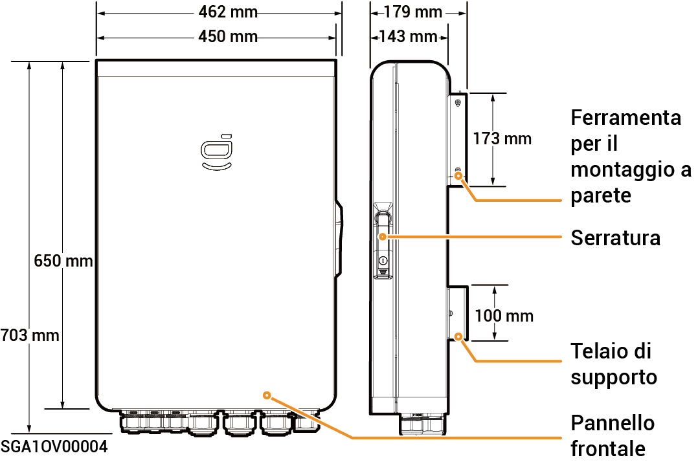
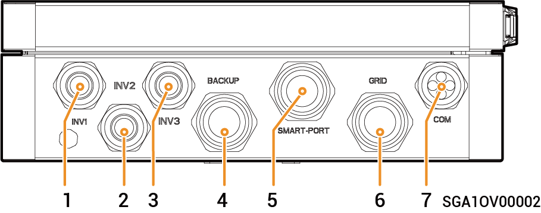
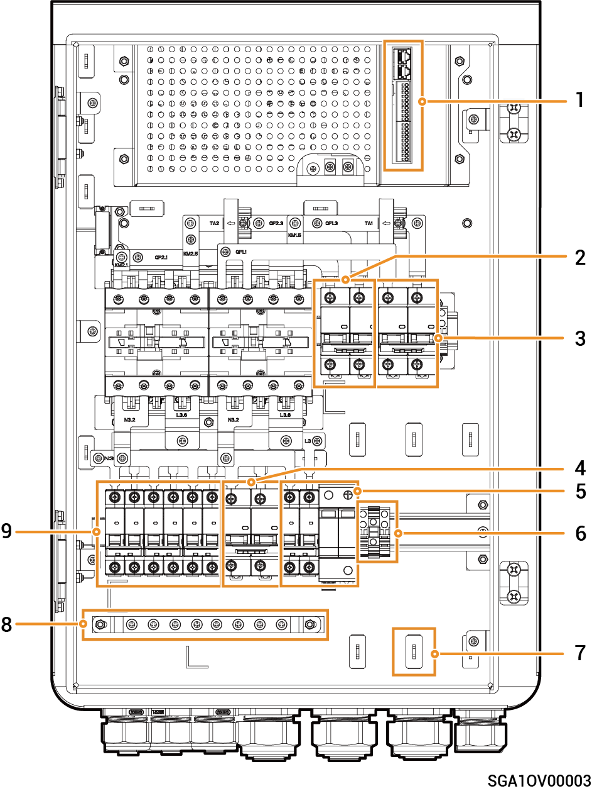

# Sigen Gateway HomeMax SP

### Dimensioni

<figure><figcaption></figcaption></figure>

### Vista dal basso

<figure><figcaption></figcaption></figure>

<table><thead><tr><th width="96">N.</th><th width="156">Indicazione</th><th>Descrizione</th></tr></thead><tbody><tr><td><strong>1</strong></td><td>INV1</td><td>Porta di ingresso cablata dell'inverter 1</td></tr><tr><td><strong>2</strong></td><td>INV2</td><td>Porta di ingresso cablata dell'inverter 2</td></tr><tr><td><strong>3</strong></td><td>INV3</td><td>Porta di ingresso cablata dell'inverter 3</td></tr><tr><td><strong>4</strong></td><td>BACKUP</td><td>Porta di ingresso cablata dei carichi domestici che necessitano del backup</td></tr><tr><td><strong>5</strong></td><td>SMART-PORT</td><td>Porta di ingresso cablata per i carichi intelligenti o per il generatore</td></tr><tr><td><strong>6</strong></td><td>GRID</td><td>Porta di ingresso cablata della rete elettrica</td></tr><tr><td><strong>7</strong></td><td>COM</td><td>Porta di ingresso cablata di comunicazione</td></tr></tbody></table>

### Vista interna

<figure><figcaption></figcaption></figure>

<table><thead><tr><th width="92">N.</th><th width="157">Etichetta</th><th>Descrizione</th></tr></thead><tbody><tr><td><strong>1</strong></td><td>-</td><td>Terminale di comunicazione (collegato al cavo di comunicazione FE o DI)</td></tr><tr><td><strong>2</strong></td><td>QF2</td><td>Interruttore automatico in miniatura (collegato ai carichi intelligenti[1] o al generatore)</td></tr><tr><td><strong>3</strong></td><td>QF1</td><td>Interruttore automatico in miniatura (collegato alla rete)</td></tr><tr><td><strong>4</strong></td><td>QF6</td><td>Interruttore automatico in miniatura (collegato ai carichi domestici che necessitano del backup)</td></tr><tr><td><strong>5</strong></td><td>QF8</td><td>Interruttore del dispositivo di protezione dalle sovratensioni</td></tr><tr><td><strong>6</strong></td><td>GND</td><td>GND</td></tr><tr><td><strong>7</strong></td><td>-</td><td>Fermacavo</td></tr><tr><td><strong>8</strong></td><td>-</td><td>Barra di messa a terra</td></tr><tr><td><strong>9</strong></td><td>QF3, QF4, QF5</td><td>Interruttore automatico in miniatura (collegato agli inverter 1, 2, 3)</td></tr></tbody></table>

Nota \[1]:

* Tutte le apparecchiature elettriche presenti nella casa del proprietario possono essere collegate come carichi intelligenti.
* Per garantire che gli utenti possano ricevere i massimi vantaggi da questo prodotto, si consiglia di collegare le apparecchiature ad elevata potenza come carichi intelligenti (pompe di calore, riscaldatori per piscine, asciugatrici, riscaldatori a immersione, ecc.) che possono essere interrotti quando il sistema di accumulo dell'energia ha poca energia a disposizione. Le altre apparecchiature a bassa potenza sono collegate come carichi domestici (lampade, router, ecc.)
