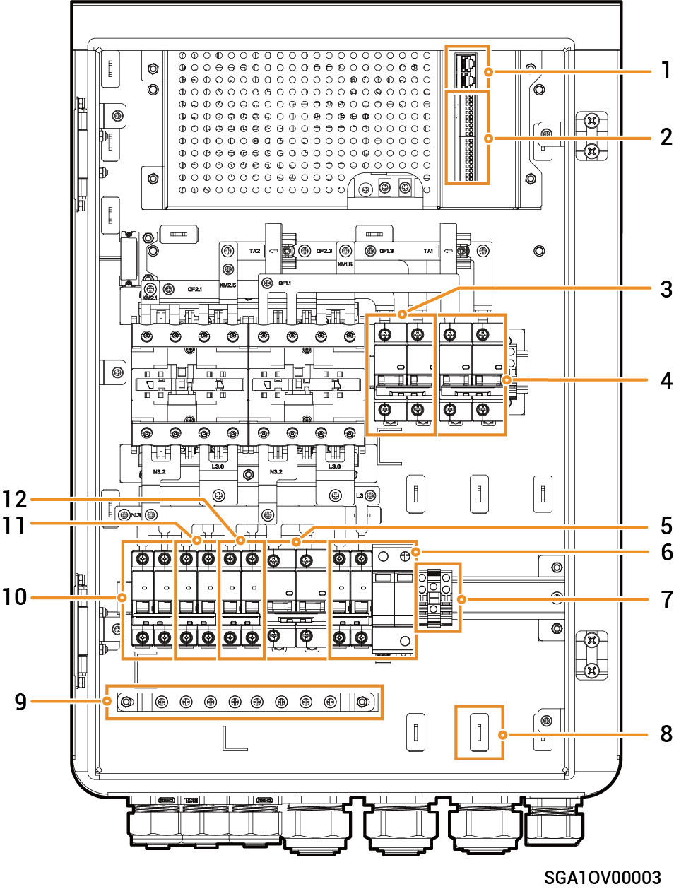

# Sigen Gateway HomeMax SP

### Dimensions

<figure><figcaption></figcaption></figure>

### Bottom View

<figure><figcaption></figcaption></figure>

<table><thead><tr><th width="96" align="center">S/N</th><th width="156">Marking</th><th>Description</th></tr></thead><tbody><tr><td align="center"><strong>1</strong></td><td>INV1</td><td>Wire-in port of inverter 1</td></tr><tr><td align="center"><strong>2</strong></td><td>INV2</td><td>Wire-in port of inverter 2</td></tr><tr><td align="center"><strong>3</strong></td><td>INV3</td><td>Wire-in port of inverter 3</td></tr><tr><td align="center"><strong>4</strong></td><td>BACKUP</td><td>Wire-in port of backup household loads</td></tr><tr><td align="center"><strong>5</strong></td><td>SMART-PORT</td><td>Wire-in port for smart Loads/ Generator</td></tr><tr><td align="center"><strong>6</strong></td><td>GRID</td><td>Wire-in port of power grid</td></tr><tr><td align="center"><strong>7</strong></td><td>COM</td><td>Wire-in port of communication</td></tr></tbody></table>

### Interior View

<figure><figcaption></figcaption></figure>

<table><thead><tr><th width="92" align="center">S/N</th><th width="157">Label</th><th>Description</th></tr></thead><tbody><tr><td align="center">1</td><td>-</td><td>Communication terminal (connecting to FE, DI or DO communication cable)</td></tr><tr><td align="center">2</td><td>-</td><td>Communication terminal (connecting to FE, DI or DO communication cable)</td></tr><tr><td align="center">3</td><td>QF2</td><td>Miniature circuit breaker (connecting to Smart Loads[1]/Generator)</td></tr><tr><td align="center">4</td><td>QF1</td><td>Miniature circuit breaker (connecting to Power grid)</td></tr><tr><td align="center">5</td><td>QF6</td><td>Miniature circuit breaker (connecting to Backup Household loads)</td></tr><tr><td align="center">6</td><td>QF8</td><td>Surge protective device switch</td></tr><tr><td align="center">7</td><td>GND</td><td>GND</td></tr><tr><td align="center">8</td><td>-</td><td>Cable clamp</td></tr><tr><td align="center">9</td><td>-</td><td>Earthing bar</td></tr><tr><td align="center">10</td><td>QF3</td><td>Miniature circuit breaker (connecting to Inverters 1, 6.0 kW)</td></tr><tr><td align="center">11</td><td>QF4</td><td>Miniature circuit breaker (connecting to Inverters 2, 6.0 kW)</td></tr><tr><td align="center">12</td><td>QF5</td><td>Miniature circuit breaker (connecting to Inverters 3, 6.0 kW)</td></tr></tbody></table>

Note \[1]:

* All the power equipment in the owner's home can be connected as smart loads.
* To ensure that this product maximizes the benefits to users, it is recommended that the high-power equipment be connected as smart loads (heat pumps, pool heaters, clothes dryers, immersion heaters, etc.), which can be cut off when the energy storage system has low power. Other low-power equipment are connected as household loads (lights, routers, etc.)
