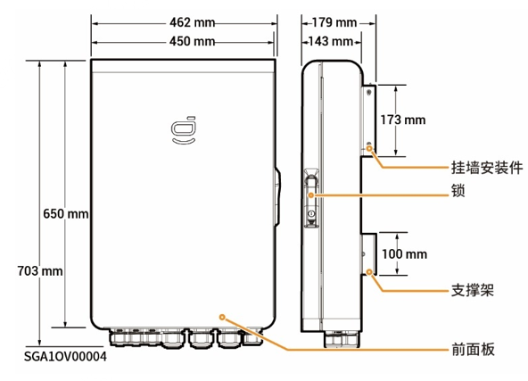
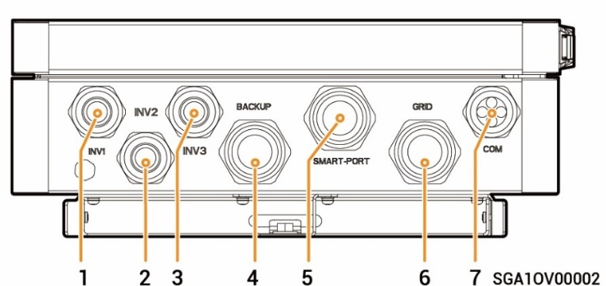
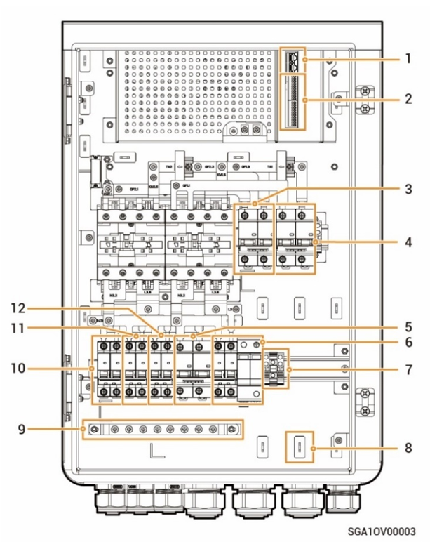

# Sigen Gateway HomeMax SP

### 尺寸图

<figure><figcaption></figcaption></figure>

### 底视图

<figure><figcaption></figcaption></figure>

<table><thead><tr><th width="116">序号</th><th width="170">丝印</th><th>名称</th></tr></thead><tbody><tr><td><strong>1</strong></td><td>INV1</td><td>逆变器进线口1</td></tr><tr><td><strong>2</strong></td><td>INV2</td><td>逆变器进线口2</td></tr><tr><td><strong>3</strong></td><td>INV3</td><td>逆变器进线口3</td></tr><tr><td><strong>4</strong></td><td>BACKUP</td><td>备电家用负载进线口</td></tr><tr><td><strong>5</strong></td><td>SMART-PORT</td><td>智能负载/发电机进线口</td></tr><tr><td><strong>6</strong></td><td>GRID</td><td>电网进线口</td></tr><tr><td><strong>7</strong></td><td>COM</td><td>通信进线口</td></tr></tbody></table>

### 内部图

<figure><figcaption></figcaption></figure>

<table><thead><tr><th>序号</th><th width="135">标签</th><th>说明</th></tr></thead><tbody><tr><td><strong>1</strong></td><td>-</td><td>FE接口</td></tr><tr><td><strong>2</strong></td><td>-</td><td>DI、DO接口</td></tr><tr><td><strong>3</strong></td><td>QF2</td><td>微型断路器（智能负载【1】/发电机）</td></tr><tr><td><strong>4</strong></td><td>QF1</td><td>微型断路器（电网）</td></tr><tr><td><strong>5</strong></td><td>QF6</td><td>微型断路器（备电家用负载）</td></tr><tr><td><strong>6</strong></td><td>QF8</td><td>浪涌保护开关</td></tr><tr><td><strong>7</strong></td><td>GND</td><td>GND端子</td></tr><tr><td><strong>8</strong></td><td>-</td><td>扎线扣</td></tr><tr><td><strong>9</strong></td><td>-</td><td>接地排</td></tr><tr><td><strong>10</strong></td><td>QF3</td><td>微型断路器（逆变器1）</td></tr><tr><td><strong>11</strong></td><td>QF4</td><td>微型断路器（逆变器2）</td></tr><tr><td><strong>12</strong></td><td>QF5</td><td>微型断路器（逆变器3）</td></tr></tbody></table>

注【1】：

* 业主家中的用电设备均可作为智能负载接入。
* 为保证本产品对用户利益最大化，建议大功率设备作为智能负载接入（如热泵、泳池加热器、干衣机、热得快等），当储能电量不足时可切出。其他小功率设备作为家用负载接入（如灯、路由器等）
