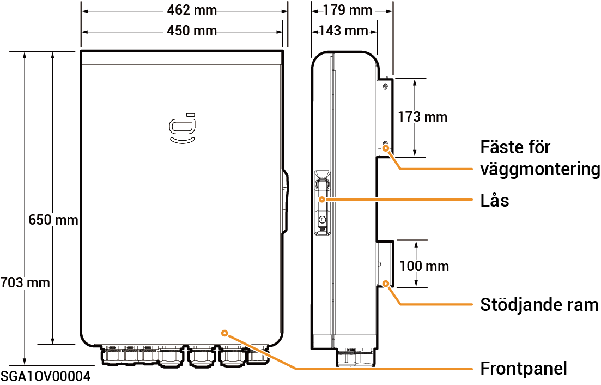

# Sigen Gateway HomeMax SP

### Mått

<figure><figcaption></figcaption></figure>

### Sedd underifrån

<figure><figcaption></figcaption></figure>

<table><thead><tr><th width="96">Siffra</th><th width="156">Märkning</th><th>Beskrivning</th></tr></thead><tbody><tr><td><strong>1</strong></td><td>INV1</td><td>Ingång för växelriktare 1</td></tr><tr><td><strong>2</strong></td><td>INV2</td><td>Ingång för växelriktare 2</td></tr><tr><td><strong>3</strong></td><td>INV3</td><td>Ingång för växelriktare 3</td></tr><tr><td><strong>4</strong></td><td>BACKUP</td><td>Ingång för hushållets reservlaster</td></tr><tr><td><strong>5</strong></td><td>SMART-PORT</td><td>Ingång för smarta laster/generator</td></tr><tr><td><strong>6</strong></td><td>GRID</td><td>Ingång för elnätet</td></tr><tr><td><strong>7</strong></td><td>COM</td><td>Ingång för kommunikation</td></tr></tbody></table>

### Sedd inifrån

<figure><figcaption></figcaption></figure>

<table><thead><tr><th width="92">Siffra</th><th width="157">Etikett</th><th>Beskrivning</th></tr></thead><tbody><tr><td><strong>1</strong></td><td>-</td><td>Kommunikationsplint (ansluten till FE- eller DI-kommunikationskabel)</td></tr><tr><td><strong>2</strong></td><td>QF2</td><td>Minikretsbrytare (ansluten till smarta laster [1]/generator)</td></tr><tr><td><strong>3</strong></td><td>QF1</td><td>Minikretsbrytare (ansluten till elnätet)</td></tr><tr><td><strong>4</strong></td><td>QF6</td><td>Minikretsbrytare (ansluten till hushållets reservlaster)</td></tr><tr><td><strong>5</strong></td><td>QF8</td><td>Överspänningsbrytare</td></tr><tr><td><strong>6</strong></td><td>JORD</td><td>JORD</td></tr><tr><td><strong>7</strong></td><td>-</td><td>Kabelklämma</td></tr><tr><td><strong>8</strong></td><td>-</td><td>Jordskena</td></tr><tr><td><strong>9</strong></td><td>QF3, QF4, QF5</td><td>Minikretsbrytare (ansluten till växelriktare 1, 2, 3)</td></tr></tbody></table>

Obs! \[1]:

* All elutrustning i ägarens hem kan anslutas som smarta laster.
* För att säkerställa att denna produkt maximerar nyttan för användarna rekommenderas att högeffektsutrustning ansluts som smarta laster (värmepumpar, poolvärmare, torktumlare, elpatroner etc.), som kan stängas av när energilagringssystemet har låg effekt. Annan lågeffektsutrustning ansluts som hushållslaster (lampor, routrar osv.).
