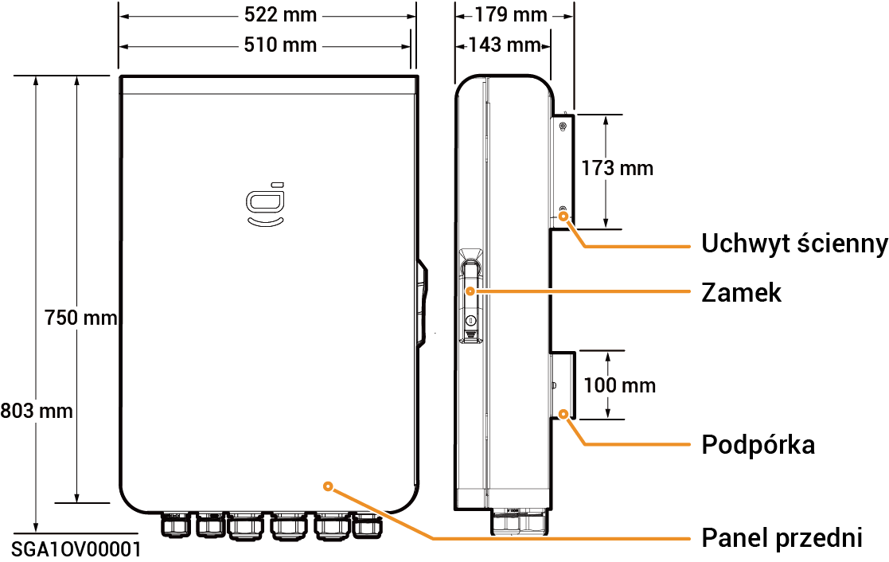

# Sigen Gateway HomeMax TP

### Wymiary

<figure><figcaption></figcaption></figure>

### Widok spodu

<figure><figcaption></figcaption></figure>

<table><thead><tr><th width="98">S/N</th><th width="166">Oznakowanie</th><th>Opis</th></tr></thead><tbody><tr><td><strong>1</strong></td><td>INV1</td><td>Port wejściowy falownika 1</td></tr><tr><td><strong>2</strong></td><td>INV2</td><td>Port wejściowy falownika 2</td></tr><tr><td><strong>3</strong></td><td>BACKUP</td><td>Port wejściowy obciążeń domowych z zasilaniem zapasowym</td></tr><tr><td><strong>4</strong></td><td>SMART-PORT</td><td>Port wejściowy odbiorników inteligentnych/generatora</td></tr><tr><td><strong>5</strong></td><td>GRID</td><td>Port wejściowy sieci energetycznej</td></tr><tr><td><strong>6</strong></td><td>COM</td><td>Port wejściowy komunikacji</td></tr></tbody></table>

### Widok wnętrza

<figure><figcaption></figcaption></figure>

<table><thead><tr><th width="86">S/N</th><th width="76">Etykieta</th><th>Opis</th></tr></thead><tbody><tr><td><strong>1</strong></td><td>-</td><td>Złącze komunikacyjne (do podłączenia przewodu komunikacyjnego FE lub DI)</td></tr><tr><td><strong>2</strong></td><td>QF2</td><td>Miniaturowy wyłącznik (do podłączenia odbiorników inteligentnych [1] /generatora)</td></tr><tr><td><strong>3</strong></td><td>QF1</td><td>Miniaturowy wyłącznik automatyczny (połączony z siecią energetyczną)</td></tr><tr><td><strong>4</strong></td><td>QF5</td><td>Miniaturowy wyłącznik (połączony z obciążeniami domowymi z zasilaniem zapasowym)</td></tr><tr><td><strong>5</strong></td><td>QF6</td><td>Przełącznik urządzenia przeciwprzepięciowego</td></tr><tr><td><strong>6</strong></td><td>GND</td><td>GND</td></tr><tr><td><strong>7</strong></td><td>-</td><td>Zacisk kablowy</td></tr><tr><td><strong>8</strong></td><td>-</td><td>Pręt uziemiający</td></tr><tr><td><strong>9</strong></td><td>QF3</td><td>Miniaturowy wyłącznik (do podłączenia falownika 1)</td></tr><tr><td><strong>10</strong></td><td>QF4</td><td>Miniaturowy wyłącznik (do podłączenia falownika 2)</td></tr></tbody></table>

Uwaga \[1]:

* Wszystkie urządzenia elektryczne w domu inwestora mogą być podłączone jako obciążenia inteligentne.
* Aby zapewnić maksymalne korzyści dla użytkowników, zaleca się podłączyć urządzenia dużej mocy jako obciążenia inteligentne (pompy ciepła, podgrzewacze do basenów, suszarki do odzieży, podgrzewacze zanurzeniowe itp.), aby można je było odłączyć, gdy w magazynie energii pozostało mało energii. Pozostałe urządzenia niskiej mocy podłącza się jako obciążenia domowe (oświetlenie, routery, itp.)
