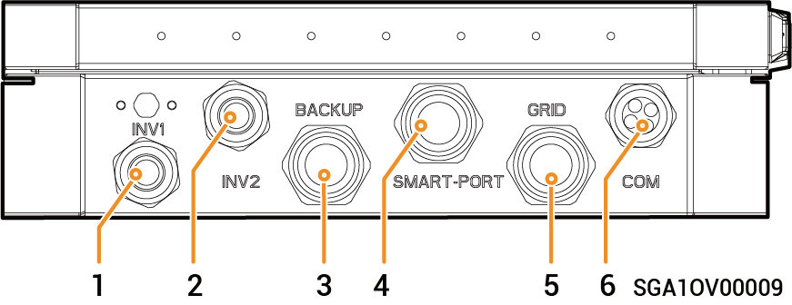
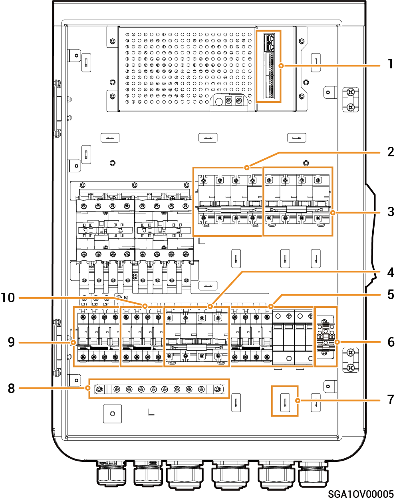

# Sigen Gateway HomeMax TP

### Dimensions

<figure><figcaption></figcaption></figure>

### Vue de dessous

<figure><figcaption></figcaption></figure>

<table><thead><tr><th width="98">N°</th><th width="166">Marquage</th><th>Description</th></tr></thead><tbody><tr><td><strong>1</strong></td><td>INV1</td><td>Port d'entrée de l'onduleur 1</td></tr><tr><td><strong>2</strong></td><td>INV2</td><td>Port d'entrée de l'onduleur 2</td></tr><tr><td><strong>3</strong></td><td>BACKUP</td><td>Port d'entrée du circuit de secours pour électroménager</td></tr><tr><td><strong>4</strong></td><td>SMART-PORT</td><td>Port d'entrée pour charges intelligentes/générateur</td></tr><tr><td><strong>5</strong></td><td>GRID</td><td>Port d'entrée du réseau électrique</td></tr><tr><td><strong>6</strong></td><td>COM</td><td>Port d'entrée de communication</td></tr></tbody></table>

### Vue intérieure

<figure><figcaption></figcaption></figure>

<table><thead><tr><th width="86">N°</th><th width="76">Étiquette</th><th>Description</th></tr></thead><tbody><tr><td><strong>1</strong></td><td>-</td><td>Borne de communication (connexion à un câble de communication FE ou DI)</td></tr><tr><td><strong>2</strong></td><td>QF2</td><td>Disjoncteur miniature (connexion à des charges intelligentes [1]/Générateur)</td></tr><tr><td><strong>3</strong></td><td>QF1</td><td>Disjoncteur miniature (connexion au réseau électrique)</td></tr><tr><td><strong>4</strong></td><td>QF5</td><td>Disjoncteur miniature (connexion au circuit de secours pour électroménager)</td></tr><tr><td><strong>5</strong></td><td>QF6</td><td>Interrupteur du parasurtenseur</td></tr><tr><td><strong>6</strong></td><td>GND</td><td>GND</td></tr><tr><td><strong>7</strong></td><td>-</td><td>Serre-câble</td></tr><tr><td><strong>8</strong></td><td>-</td><td>Barre de mise à la terre</td></tr><tr><td><strong>9</strong></td><td>QF3</td><td>Disjoncteur miniature (connexion à l'onduleur 1)</td></tr><tr><td><strong>10</strong></td><td>QF4</td><td>Disjoncteur miniature (connexion à l'onduleur 2)</td></tr></tbody></table>

Remarque \[1] :

* Tous les équipements électriques de la maison du propriétaire peuvent être connectés en tant que charges intelligentes.
* Afin de garantir que ce produit offre un maximum d'avantages aux utilisateurs, nous recommandons que les équipements à forte consommation soient connectés en tant que charges intelligentes (pompes à chaleur, chauffe-piscines, sèche-linges, thermoplongeurs, etc.), celles-ci pouvant être coupées lorsque le système de stockage d'énergie présente une faible charge. Les autres équipements à faible consommation sont connectés en tant que charges domestiques (lampes, routeurs, etc.).
