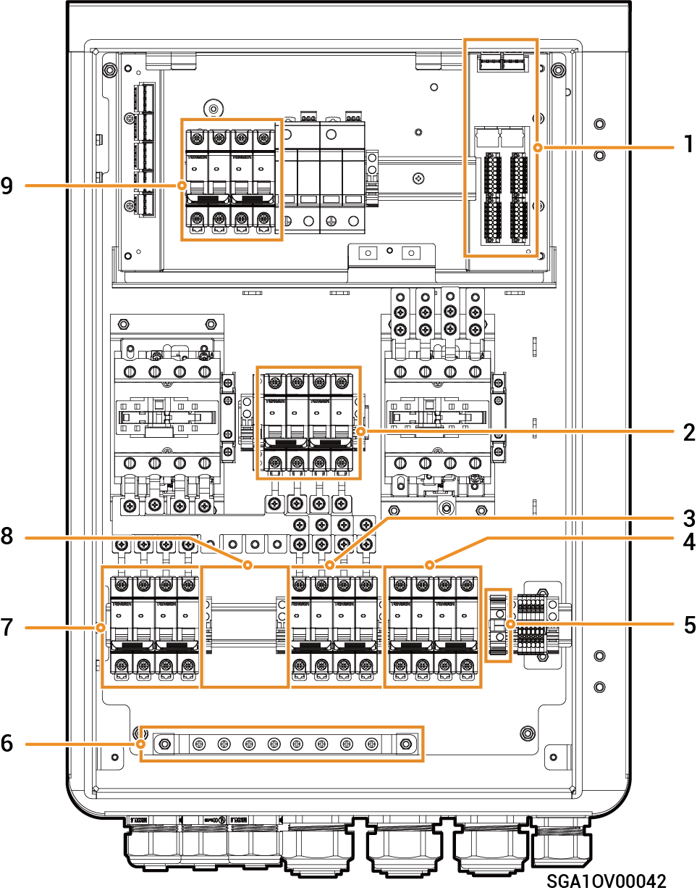

# Sigen Gateway HomePro TP-L

### Mitat

<figure><figcaption></figcaption></figure>

### Sisänäkymä

<figure><figcaption></figcaption></figure>

<table><thead><tr><th width="91.75" align="center" valign="middle">S/N</th><th width="109.75" valign="middle">Tarra</th><th valign="top">Kuvaus</th></tr></thead><tbody><tr><td align="center" valign="middle">1</td><td valign="middle">&ndash;</td><td valign="top">
Viestint&auml;liitin

(liitetty FE- tai DI-viestint&auml;kaapeliin)
</td></tr><tr><td align="center" valign="middle">2</td><td valign="middle">QS1</td><td valign="top">Ohituskytkin</td></tr><tr><td align="center" valign="middle">3</td><td valign="middle">QF3</td><td valign="top">
Pienkatkaisija

(liitetty kotitalouskuormien varavoimaan)
</td></tr><tr><td align="center" valign="middle">4</td><td valign="middle">QF1</td><td valign="top">
Pienkatkaisija

(liitetty s&auml;hk&ouml;verkkoon)
</td></tr><tr><td align="center" valign="middle">5</td><td valign="middle">GND</td><td valign="top">Maadoitusliitin</td></tr><tr><td align="center" valign="middle">6</td><td valign="middle">&ndash;</td><td valign="top">Maadoituspalkki</td></tr><tr><td align="center" valign="middle">7</td><td valign="middle">QF2</td><td valign="top">
Pienkatkaisija

(liitetty invertteriin 1)
</td></tr><tr><td align="center" valign="middle">8</td><td valign="middle">&ndash;</td><td valign="top">
(Valinnainen) Katkaisijan asennuspaikka

(liitetty inverttereihin 2) [1]
</td></tr><tr><td align="center" valign="middle">9</td><td valign="middle">QF4</td><td valign="top">Ylij&auml;nnitesuojakytkin</td></tr></tbody></table>

Huomaa [1]:

Katkaisija on omistajan valmisteltava. Katso tarkemmat tiedot kyseisen mallin asennusoppaasta.
