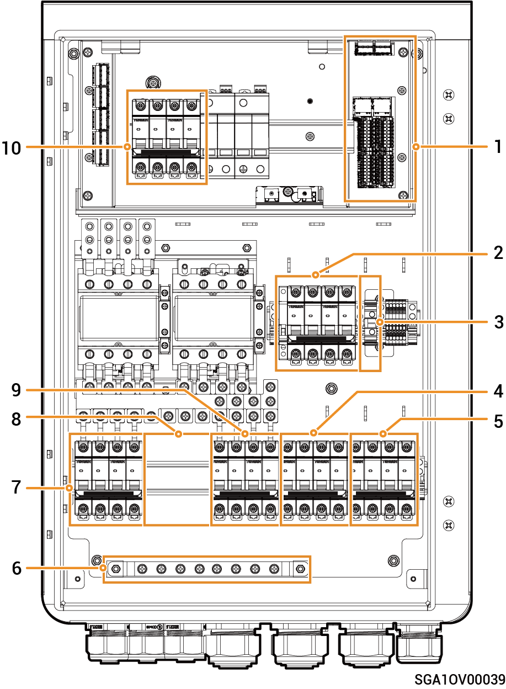

# Sigen Gateway HomePro TP

### 尺寸图

<figure><figcaption></figcaption></figure>

### 内部图

<figure><figcaption></figcaption></figure>

<table><thead><tr><th width="75.5" align="center" valign="top">序号</th><th width="94" valign="top">标签</th><th valign="top">说明</th></tr></thead><tbody><tr><td align="center" valign="top">1</td><td valign="top">–</td><td valign="top">通信端子（连接FE、DI等通信线）</td></tr><tr><td align="center" valign="top">2</td><td valign="top">QS1</td><td valign="top">旁路开关</td></tr><tr><td align="center" valign="top">3</td><td valign="top">QF2</td><td valign="top">微型断路器（智能负载【1】/柴油发电机）</td></tr><tr><td align="center" valign="top">4</td><td valign="top">QF1</td><td valign="top">微型断路器（电网）</td></tr><tr><td align="center" valign="top">5</td><td valign="top">-</td><td valign="top">GND端子</td></tr><tr><td align="center" valign="top">6</td><td valign="top">-</td><td valign="top">接地铜排</td></tr><tr><td align="center" valign="top">7</td><td valign="top">QF3</td><td valign="top">微型断路器（逆变器1）</td></tr><tr><td align="center" valign="top">8</td><td valign="top">–</td><td valign="top">（预留）微型断路器安装位置（连接逆变器2）【2】</td></tr><tr><td align="center" valign="top">9</td><td valign="top">QF4</td><td valign="top">微型断路器（备电家用负载）</td></tr><tr><td align="center" valign="top">10</td><td valign="top">QF5</td><td valign="top">浪涌保护器开关</td></tr></tbody></table>

注【1】：

* 业主家中的用电设备均可作为智能负载接入。
* 为保证本产品对用户利益最大化，建议大功率设备作为智能负载接入（如第三方逆变器、热泵、泳池加热器、干衣机、热得快等），当储能电量不足时可切出。其他小功率设备作为家用负载接入（如灯、路由器等）

注【2】：

* 断路器需业主自行准备，具体规格和安装步骤请参考该型号能源备电柜的安装指南。
