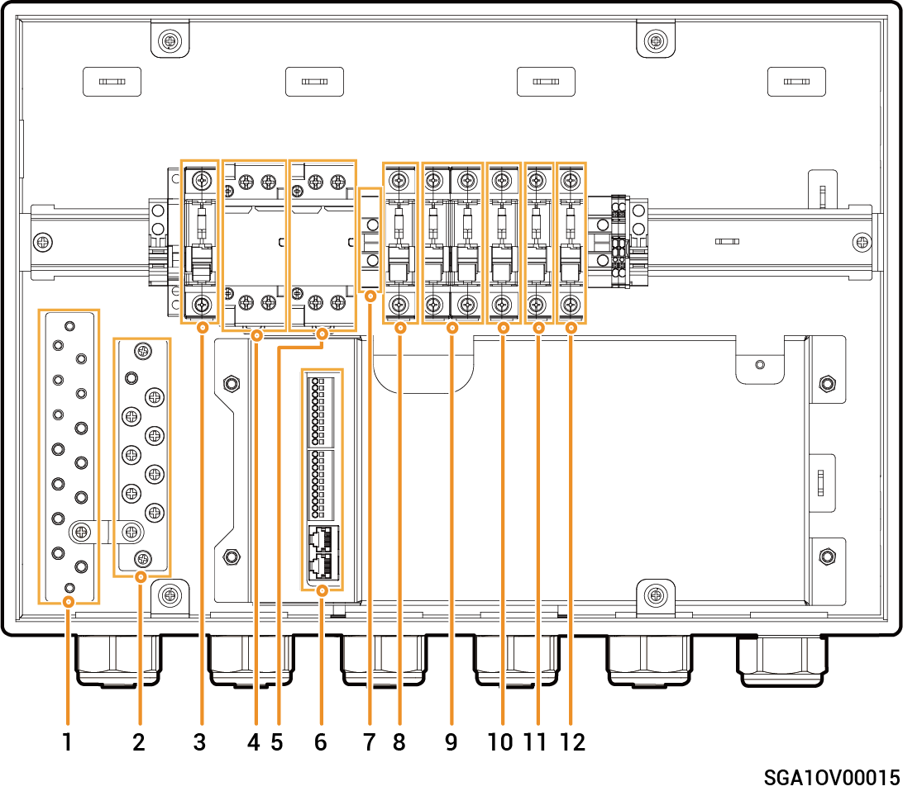

# Sigen Gateway SP AU

### 尺寸图

<figure><figcaption></figcaption></figure>

### 内部图

<figure><figcaption></figcaption></figure>

<table><thead><tr><th width="74">序号</th><th width="110">标签</th><th width="598">说明</th></tr></thead><tbody><tr><td><strong>1</strong></td><td>-</td><td>N线铜排</td></tr><tr><td><strong>2</strong></td><td>-</td><td>接地铜排</td></tr><tr><td><strong>3</strong></td><td>QS1</td><td>旁路开关</td></tr><tr><td><strong>4</strong></td><td>KM1</td><td>网侧接触器</td></tr><tr><td><strong>5</strong></td><td>KM2</td><td>发电机侧接触器</td></tr><tr><td><strong>6</strong></td><td>-</td><td>通信端子（连接FE、DI等通信线）</td></tr><tr><td><strong>7</strong></td><td>X1</td><td>端子（连接非备电负载）</td></tr><tr><td><strong>8</strong></td><td>QF1</td><td>微型断路器（连接电网）</td></tr><tr><td><strong>9</strong></td><td>QF2</td><td>微型断路器（连接发电机/智能负载 [1]）</td></tr><tr><td><strong>10</strong></td><td>QF3</td><td>微型断路器（连接单相逆变器，支持功率8.0-10.0kW ）</td></tr><tr><td><strong>11</strong></td><td>QF4</td><td>微型断路器（连接单相逆变器，支持功率5.0-6.0kW）</td></tr><tr><td><strong>12</strong></td><td>QF5</td><td>微型断路器（连接家用负载）</td></tr></tbody></table>

Note \[1]:

* All the power equipment in the owner's home can be connected as smart loads.
* To ensure that this product maximizes the benefits to users, it is recommended that the high-power equipment be connected as smart loads (heat pumps, pool heaters, clothes dryers, immersion heaters, clothes dryers, immersion heaters, etc.), which can be cut off when the energy storage system has low power. Other low-power equipment are connected as household loads (lights, routers, etc.)
