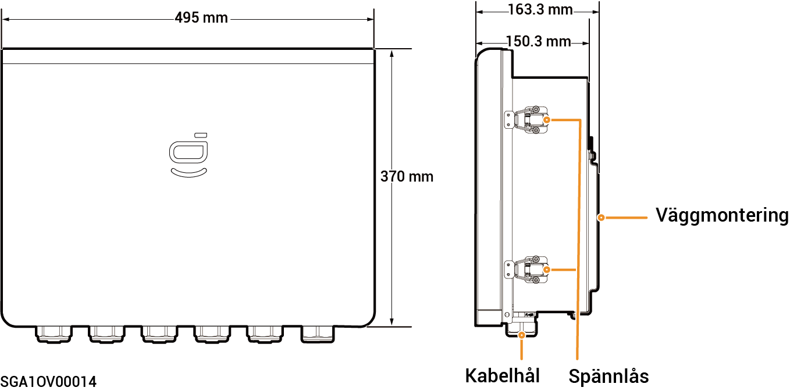

# Sigen Gateway SP AU

### Mått

<figure><figcaption></figcaption></figure>

### Sedd inifrån

<figure><figcaption></figcaption></figure>

<table><thead><tr><th width="74">Siffra</th><th width="80">Etikett</th><th width="598">Beskrivning</th></tr></thead><tbody><tr><td><strong>1</strong></td><td>-</td><td>N-skena av koppar</td></tr><tr><td><strong>2</strong></td><td>-</td><td>Jordskena av koppar</td></tr><tr><td><strong>3</strong></td><td>QS1</td><td>Förbikopplingsbrytare</td></tr><tr><td><strong>4</strong></td><td>KM1</td><td>Nätbrytare</td></tr><tr><td><strong>5</strong></td><td>KM2</td><td>Generatorbrytare</td></tr><tr><td><strong>6</strong></td><td>-</td><td>Kommunikationsplint (ansluten till FE- eller DI-kommunikationskabel)</td></tr><tr><td><strong>7</strong></td><td>X1</td><td>Plint (ansluten till last som ej är reserv)</td></tr><tr><td><strong>8</strong></td><td>QF1</td><td>Minikretsbrytare (ansluten till elnätet)</td></tr><tr><td><strong>9</strong></td><td>QF2</td><td>Minikretsbrytare (ansluten till en generator/smart last [1])</td></tr><tr><td><strong>10</strong></td><td>QF3</td><td>Minikretsbrytare (ansluten till en enfas växelriktare i effektområdet mellan 8,0 och 10,0 kW)</td></tr><tr><td><strong>11</strong></td><td>QF4</td><td>Minikretsbrytare (ansluten till en enfas växelriktare i effektområdet mellan 5,0 och 6,0 kW)</td></tr><tr><td><strong>12</strong></td><td>QF5</td><td>Minikretsbrytare (ansluten till en hushållslast)</td></tr></tbody></table>

Obs! \[1]:

* All elutrustning i ägarens hem kan anslutas som smarta laster.
* För att säkerställa att denna produkt maximerar nyttan för användarna rekommenderas att högeffektsutrustning ansluts som smarta laster (värmepumpar, poolvärmare, torktumlare, elpatroner etc.), som kan stängas av när energilagringssystemet har låg effekt. Annan lågeffektsutrustning ansluts som hushållslaster (lampor, routrar osv.).
