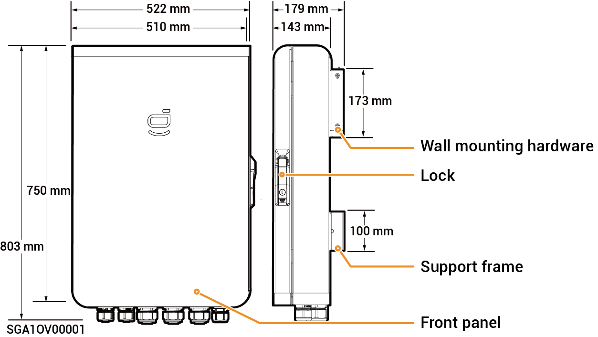
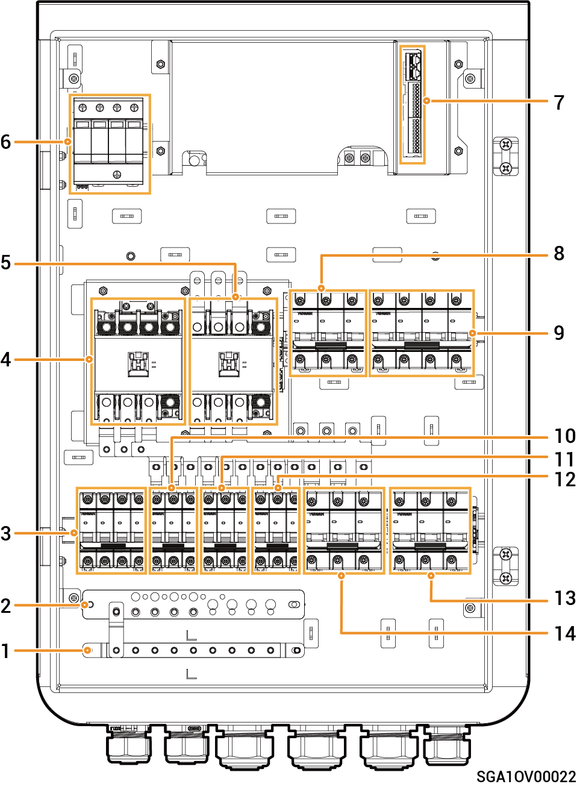

# Sigen Gateway (TP AU, HomeMax TP CN)

### **Dimensions**

<figure><figcaption></figcaption></figure>

### Bottom View

<figure><figcaption></figcaption></figure>

<table><thead><tr><th width="85">S/N</th><th width="164">Marking</th><th>Description</th></tr></thead><tbody><tr><td><strong>1</strong></td><td>INV1</td><td>Wire-in port of inverter 1</td></tr><tr><td><strong>2</strong></td><td>INV2</td><td>Wire-in port of inverter 2</td></tr><tr><td><strong>3</strong></td><td>BACKUP</td><td>Wire-in port of backup Household loads</td></tr><tr><td><strong>4</strong></td><td>SMART-PORT</td><td>Wire-in port for smart loads /Generator</td></tr><tr><td><strong>5</strong></td><td>GRID</td><td>Wire-in port of power grid</td></tr><tr><td><strong>6</strong></td><td>COM</td><td>Wire-in port of communication</td></tr></tbody></table>

### Interior View

<figure><figcaption></figcaption></figure>

<table><thead><tr><th width="82">S/N</th><th width="103">Label</th><th>Description</th></tr></thead><tbody><tr><td><strong>1</strong></td><td>-</td><td>Grounding copper busbar</td></tr><tr><td><strong>2</strong></td><td>-</td><td>N-line copper busbar</td></tr><tr><td><strong>3</strong></td><td>QF7</td><td>Surge protective device switch</td></tr><tr><td><strong>4</strong></td><td>KM2</td><td>Generator contactor</td></tr><tr><td><strong>5</strong></td><td>KM1</td><td>Grid contactor</td></tr><tr><td><strong>6</strong></td><td>SPD</td><td>Surge protective device</td></tr><tr><td><strong>7</strong></td><td>-</td><td>Communication terminal (connecting to FE or DI communication cable)</td></tr><tr><td><strong>8</strong></td><td>QS1</td><td>Bypass switch</td></tr><tr><td><strong>9</strong></td><td>QF2</td><td>Miniature circuit breaker (connecting to a smart load[1]/Generator)</td></tr><tr><td><strong>10</strong></td><td>QF3</td><td>Miniature circuit breaker (connecting to a three-phase inverter in a power range of 17.0 kW to 30.0kW)</td></tr><tr><td><strong>11</strong></td><td>QF4</td><td>Miniature circuit breaker (connecting to a three-phase inverter in a power range of 17.0 kW to 30.0kW)</td></tr><tr><td><strong>12</strong></td><td>QF5</td><td>Miniature circuit breaker (connecting to a three-phase inverter in a power range of 5.0kW to 15.0kW)</td></tr><tr><td><strong>13</strong></td><td>QF1</td><td>Miniature circuit breaker (connecting to the power grid)</td></tr><tr><td><strong>14</strong></td><td>QF6</td><td>Miniature circuit breaker (connecting to a household load)</td></tr></tbody></table>

Note \[1]:

* All the power equipment in the owner's home can be connected as smart loads.
* To ensure that this product maximizes the benefits to users, it is recommended that the high-power equipment be connected as smart loads (heat pumps, pool heaters, clothes dryers, immersion heaters, etc.), which can be cut off when the energy storage system has low power. Other low-power equipment are connected as household loads (lights, routers, etc.)
