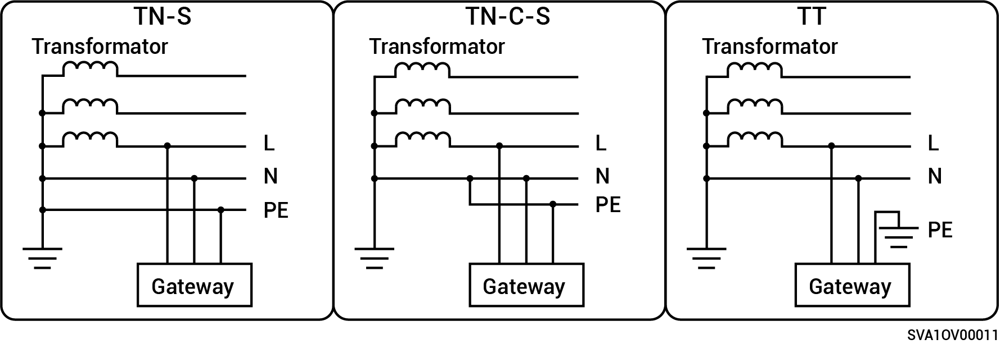

# Obsługiwane sposoby zasilania sieci energetycznej

* Obsługiwane sposoby zasilania sieciowego obejmują TN-S, TN-C-S, oraz TT.
* Jeśli zasilanie realizowane jest metodą TT w odniesieniu do sieci energetycznej, napięcie pomiędzy N i PE musi wynosić < 30 V.

**Produkty z jednofazowej serii Gateway:**

<figure><figcaption></figcaption></figure>

**Produkty z serii trójfazowej Gateway:**

<figure><figcaption></figcaption></figure>
