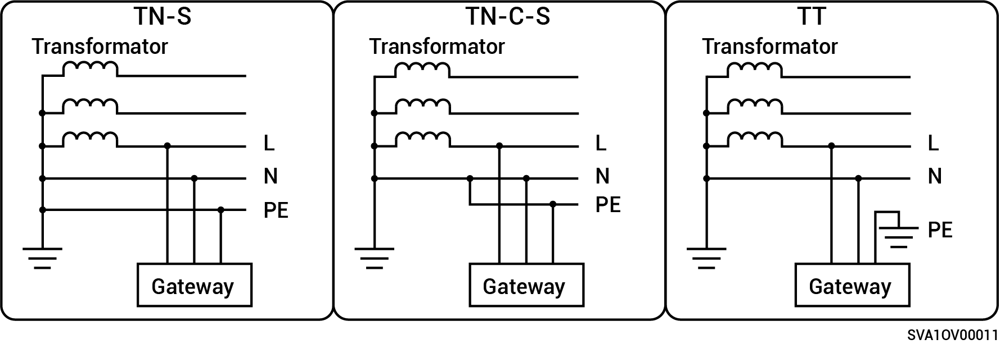

# Metoder för strömförsörjning till elnätet som stöds

* De metoder för nätförsörjning som stöds är TN-S, TN-C-S och TT.
* När TT används som metod för strömförsörjning till elnätet ska spänningen mellan N och PE vara < 30 V.

**Gateway-produkter i enfas-serien:**

<figure><figcaption></figcaption></figure>

**Gateway-produkter i trefas-serien:**

<figure><figcaption></figcaption></figure>
