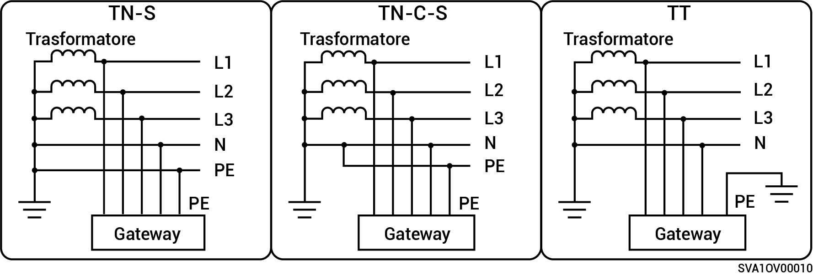

# Metodi di alimentazione supportati per la rete elettrica

* I metodi di alimentazione della rete supportati comprendono i sistemi TN-S, TN-C-S e TT.
* Nel caso in cui si utilizzi il sistema TT come tecnica di alimentazione per la rete elettrica, la tensione tra N e PE deve essere < 30 V.

**Prodotti della serie gateway monofase:**

<figure><figcaption></figcaption></figure>

**Prodotti della serie gateway trifase:**

<figure><figcaption></figcaption></figure>
