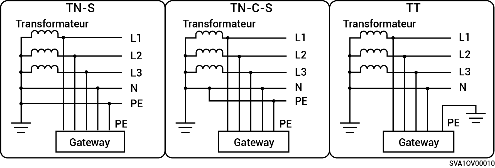

# Méthodes d'alimentation du réseau électrique

* Les méthodes d'alimentation du réseau prises en charge sont TN-S, TN-C-S et TT.
* Si la méthode TT est utilisée pour alimenter le réseau électrique, la tension entre les bornes N et PE doit être inférieure à 30 V.

**Produits de la gamme monophasée Gateway** :

<figure><figcaption></figcaption></figure>

**Produits de la gamme triphasée Gateway** :

<figure><figcaption></figcaption></figure>
