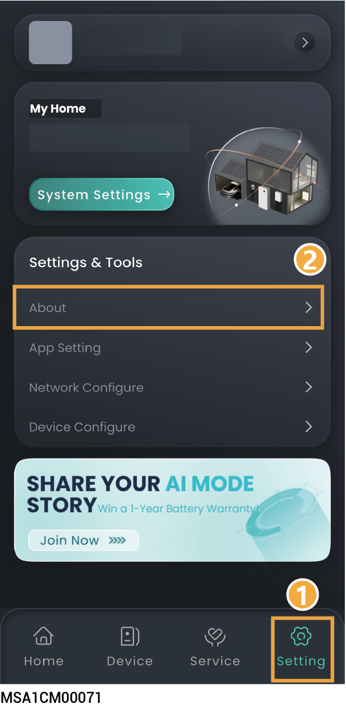
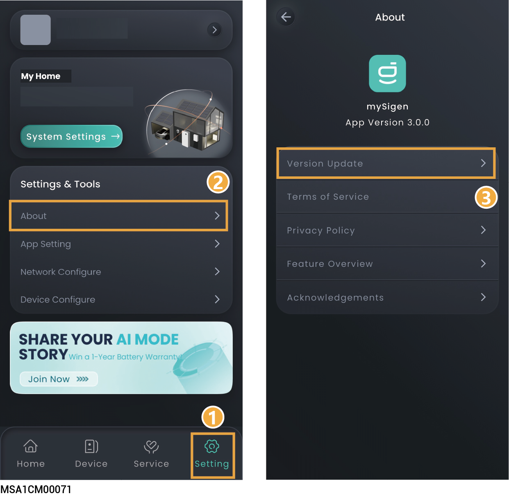
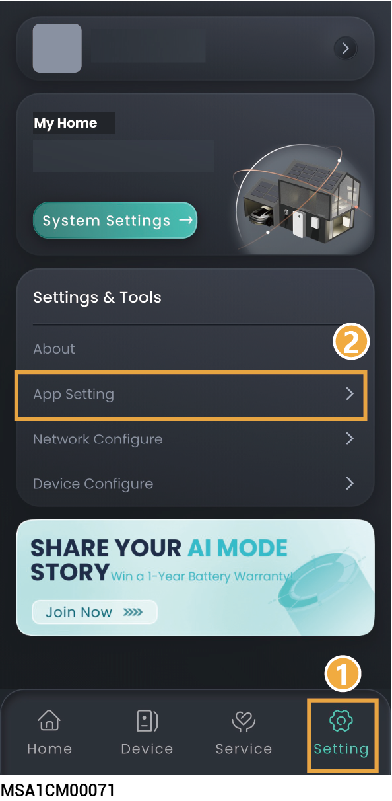

# App Setting

## Viewing App version

<figure><figcaption></figcaption></figure>

## Upgrading mySigen



<mark style="color:blue;">To gain the best compatibility and performance, you are advised to upgrade the mySigen App regularly.</mark>

<figure><figcaption></figcaption></figure>

## Configuring parameters on the "App Setting" screen



<mark style="color:blue;">Settable parameters on the "App Setting" page vary with equipment. The actual screen shall prevail.</mark>

<figure><figcaption></figcaption></figure>

<table><thead><tr><th width="80">No.</th><th width="168.0909423828125">Parameter name</th><th>Description</th></tr></thead><tbody><tr><td>1</td><td>Dark Mode</td><td>Sets the display style of the App.</td></tr><tr><td>2</td><td>Language</td><td>Sets the display language of the App.</td></tr><tr><td>3</td><td>Sunrise/Sunset Time Format</td><td>Set a 12-hour system or a 24-hour system.</td></tr><tr><td>4</td><td>Temperature Unit</td><td>
Sets the unit of temperature.

The unit of temperature commonly used in the local area is set in the App by default. You can change this setting when needed.
</td></tr><tr><td>5</td><td>Notification</td><td>
Sets the message notification permission.

There will be a prompt message on the "Messages" on the "Service" page when the parameter is set to 
</td></tr><tr><td>6</td><td>Lab</td><td>
Sets the access permission of Sigen AI.

You can ask Sigen AI about the product knowledge when the parameter is set to 
</td></tr><tr><td>7</td><td>Diagnostic tool</td><td>If an exception occurs when you use the App, you can use this tool to generate operation logs and report to our customer support for analysis and solutions.</td></tr></tbody></table>
