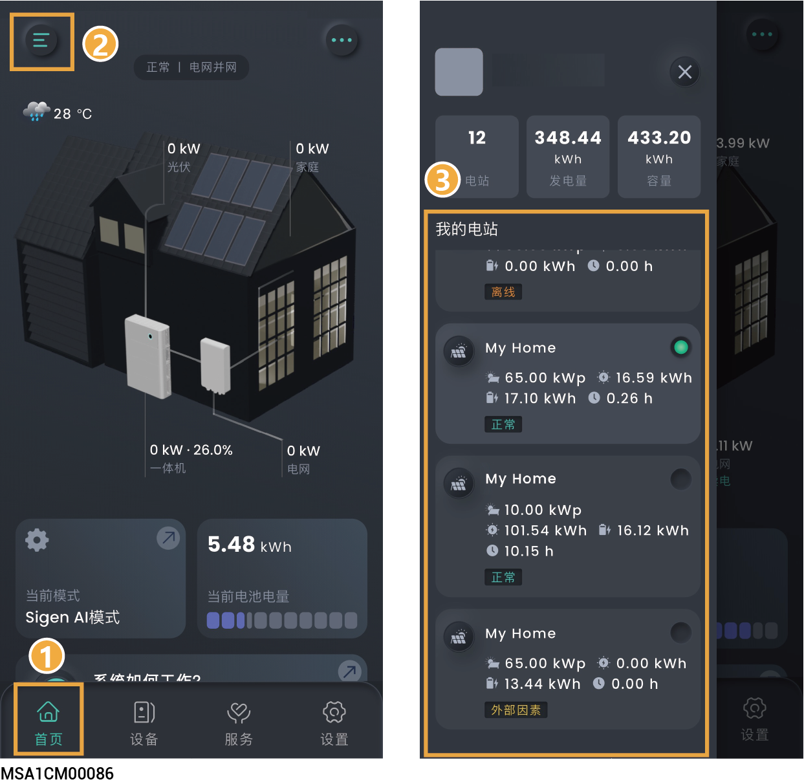
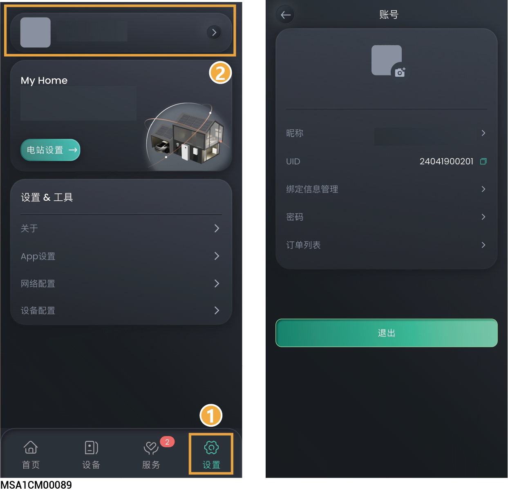

# 账号设置

## **切换账号**

若您拥有本公司多款设备，并拥有多个账号，App支持快速切换账号。

<figure><figcaption></figcaption></figure>

## **账号信息**

<figure><figcaption></figcaption></figure>

<table><thead><tr><th width="70" align="center" valign="middle">序号</th><th width="179.181884765625" valign="middle">参数名称</th><th valign="top">说明</th></tr></thead><tbody><tr><td align="center" valign="middle">1</td><td valign="middle">昵称</td><td valign="top">点击修改账号昵称。</td></tr><tr><td align="center" valign="middle">2</td><td valign="middle">UID</td><td valign="top">点击复制个人用户 ID。</td></tr><tr><td align="center" valign="middle">3</td><td valign="middle">绑定信息管理</td><td valign="top">点击修改账号绑定信息，如邮箱信息。</td></tr><tr><td align="center" valign="middle">5</td><td valign="middle">密码</td><td valign="top">点击修改账号密码。</td></tr><tr><td align="center" valign="middle">5</td><td valign="middle">订单列表</td><td valign="top">点击查看购物订单。</td></tr></tbody></table>
