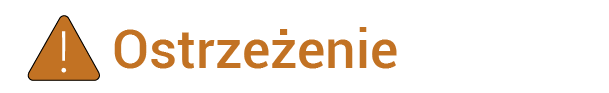
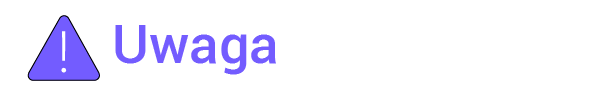

# Informacje ogólne

### **Wprowadzenie**

W dokumencie znajdują się ogólne informacje na temat produktu, okablowania instalacji, obsługi i konserwacji urządzeń SigenStor Home.

### **Odbiorcy**

Dokument jest przeznaczony dla użytkowników urządzenia i specjalistów.

### **Znaczenie symboli**

W dokumencie mogą być stosowane następujące symbole, które oznaczają środki ostrożności lub istotne informacje. Przed montażem, obsługą i konserwacją urządzenia należy zapoznać się z symbolami i ich znaczeniem.

<table><thead><tr><th width="186">Symbol</th><th>Opis</th></tr></thead><tbody><tr><td></td><td>Niebezpieczeństwo. Niezastosowanie się do wskazówek niesie ryzyko utraty życia lub doznania poważnych obrażeń ciała.</td></tr><tr><td></td><td>Ostrzeżenie. Zaniedbanie tego zalecenia stwarza ryzyko poważnych obrażeń ciała lub szkód materialnych.</td></tr><tr><td></td><td>Uwaga. Zaniedbanie tego zalecenia prowadzi do szkód materialnych.</td></tr><tr><td></td><td>Ważne lub kluczowe informacje oraz dodatkowe wskazówki na temat obsługi.</td></tr></tbody></table>
