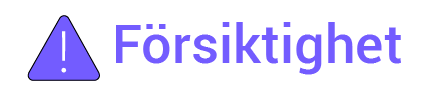

# Översikt

### **Introduktion**

Detta dokument innehåller huvudsakligen en presentation av enheterna i SigenStor Home samt information om systemkoppling, systemdrift och underhåll.

### **Målgrupp**

Dokumentet är avsett för produktanvändare och yrkesmän.

### **Definition av symboler**

Följande symboler används i dokumentet för att påvisa förebyggande säkerhetsåtgärder eller viktig information. Före installation, drift och underhåll av utrustningen ska du bekanta dig med skyltar och deras definitioner.

<table><thead><tr><th width="186">Symboler</th><th>Definition</th></tr></thead><tbody><tr><td></td><td>Fara. Dödsfall eller allvarlig personskada kommer att uppstå om detta inte uppmärksammas.</td></tr><tr><td></td><td>Varningar. Allvarlig personskada eller skada på egendom kommer att uppstå om detta inte uppmärksammas.</td></tr><tr><td></td><td>Försiktighet. Skada på egendom kommer att uppstå om detta inte uppmärksammas.</td></tr><tr><td></td><td>Viktig eller avgörande information och kompletterande driftinformation.</td></tr></tbody></table>
