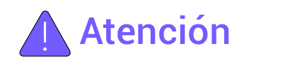

# Generalidades

### **Introducción**

Este documento presenta principalmente la introducción al producto, el cableado del sistema, el funcionamiento del sistema y el mantenimiento de los dispositivos de SigenStor Home.

### **Audiencia**

Este documento es adecuado para usuarios del producto y profesionales.

### **Definición de las señales**

En el documento pueden usase las señales siguientes para indicar precauciones de seguridad o información clave. Antes de instalar, utilizar o mantener el equipo, familiarícese con las señales y sus definiciones.

<table><thead><tr><th width="186" valign="middle">Señal</th><th>Definición</th></tr></thead><tbody><tr><td valign="middle"></td><td>Peligro. No respetarla provocará muerte o lesiones graves.</td></tr><tr><td valign="middle"></td><td>Advertencia. No respetarlas provocará lesiones graves o daños materiales.</td></tr><tr><td valign="middle"></td><td>Atención. No respetarlas provocará daños materiales.</td></tr><tr><td valign="middle"></td><td>Información importante o clave y sugerencias de utilización adicionales.</td></tr></tbody></table>
