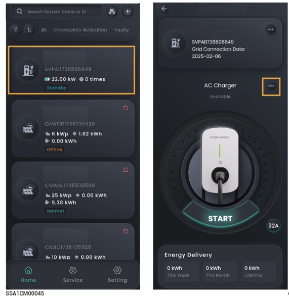
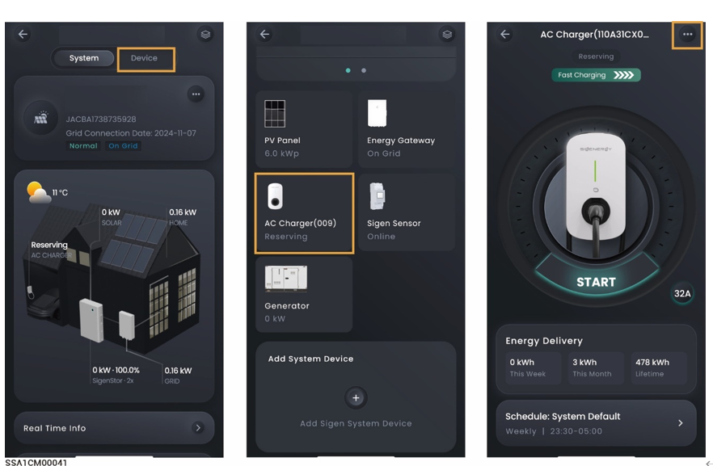

# Sigen EV AC Charger



<mark style="color:blue;">纯充场景仅可接入一台Sigen EV AC Charger，光充或光储场景一台SigenStor最多可接入两台Sigen EV AC Charger。</mark>

### 纯充场景

<figure><figcaption></figcaption></figure>

### 光充或光储充场景



* <mark style="color:blue;">接入一台Sigen EV AC Charger需和SigenStor连接FE网线。</mark>
* <mark style="color:blue;">接入两台Sigen EV AC Charger需和SigenStor连接相同WLAN网络，添加步骤参见</mark> [售后服务](../station-parameter-setup/after-sales-service.md)。

<figure><figcaption></figcaption></figure>

<table><thead><tr><th width="77">序号</th><th width="146">参数名称</th><th width="141">参数名称</th><th>说明</th></tr></thead><tbody><tr><td><strong>1</strong></td><td>Charging Record</td><td>-</td><td>可查看充电记录。</td></tr><tr><td><strong>2</strong></td><td>Charging Mode</td><td>-</td><td>
可设置Sigen EV AC Charger工作模式：
<ul><li>Fast Charging</li><li>Solar Boost Charging</li><li>100% PV Charging The maximu</li></ul></td></tr><tr><td><strong>3</strong></td><td>OCPP Setting</td><td>-</td><td>设置为 时，Sigen EV AC Charger可以连接到OCPP的服务器，使用者可以从URL下拉菜单选择OCPP的平台。</td></tr><tr><td><strong>4</strong></td><td>Authorization</td><td>-</td><td>充电鉴权设置。设置为 时，可无鉴权充电。</td></tr><tr><td><strong>5</strong></td><td>Card Management</td><td>-</td><td>绑定Sigen RFID card。</td></tr><tr><td><strong>6</strong></td><td>Advanced Mode</td><td>Output Mode</td><td>根据实际安装的电网情况，选择单相或三相输出充电。</td></tr><tr><td><strong>7</strong></td><td>Advanced Mode</td><td>Dynamic load management</td><td>组网中安装Power Sensor后，且非离网状态，设置为 时，Sigen EV AC Charger将支持动态负载管理（DLM）。Sigen EV AC Charger通过比较Power Sensor上报的并网点功率信息和安装商开局时设置的“Rated Household Circuit Breaker Current”值，快速并智能的调整充电电流（功率），防止配电单元内Household Circuit Breaker断开。</td></tr><tr><td><strong>8</strong></td><td>Advanced Mode</td><td>Home air circuit breaker rated current</td><td>入户空开的电流规格，控制交流桩的充电功率，使入户电流小于该设置值。</td></tr><tr><td><strong>9</strong></td><td>Advanced Mode</td><td>Allow charging when off-grid</td><td>设置为 时，离网运行时允许充电。</td></tr><tr><td><strong>10</strong></td><td>Connectivity</td><td>Ethernet</td><td><ul><li>显示FE连接状态。</li><li>FE网络连接参数默认DHCP自动获取。若您需要更改，请按以下步骤操作：:</li></ul><ol><li>配置一个可以正常上网的WLAN，或插入4G流量卡。</li><li>待“WLAN”或“Cellular”显示已连接后，拔出设备用于连接网络的网线。</li><li>将“Obtain IP address automatically”设置为 ，修改参数。</li></ol>
4. 重新将用于连接网络的网线插入设备。
</td></tr><tr><td><strong>11</strong></td><td>Connectivity</td><td>WLAN</td><td>
显示WLAN连接状态。若此处显示未连接，但您想采用WLAN连接网络，可选择支持2.4g频段的WLAN热点进行连接。 注：
<ul><li>连接非加密WLAN，可能导致网络不可用，不推荐使用。</li><li>当设备仅可用WLAN连接网络时，不可切换其他无线路由器WLAN。</li></ul></td></tr><tr><td><strong>12</strong></td><td>Connectivity</td><td>Cellular</td><td><ul><li>显示4G连接状态。若此处显示未连接，但您想采用4G连接网络，请确保4G流量卡已插入。</li><li>当采用4G通信时，可查看当前每月使用的流量，同时可设置每月使用流量阈值。</li></ul></td></tr><tr><td><strong>13</strong></td><td>Connectivity</td><td>Grid Code</td><td>根据设备所在的国家/地区设置电网标准码。</td></tr><tr><td><strong>14</strong></td><td>Connectivity</td><td>Home air circuit breaker</td><td>根据配电单元内的家庭总输入断路器设置额定电流值。</td></tr><tr><td><strong>15</strong></td><td>Connectivity</td><td>Input circuit breaker rated current</td><td>根据配电单元内设备连接的断路器设置额定电流值。</td></tr><tr><td><strong>16</strong></td><td>Connectivity</td><td>Charging pile type</td><td>可选择充电桩类型。</td></tr><tr><td><strong>17</strong></td><td>Connectivity</td><td>Ground mode</td><td>根据当地电网类型设置接地类型。</td></tr><tr><td><strong>18</strong></td><td>Connectivity</td><td>Phase Type</td><td>根据设备实际接线设置相线类型。</td></tr><tr><td><strong>19</strong></td><td>Connectivity</td><td>Maintenance</td><td>Reset：设备重启。</td></tr></tbody></table>



<mark style="color:blue;">Sigen EV AC Charger用户日常使用方式及注意事项请参见《Sigen EV AC Charger用户手册》。</mark>
