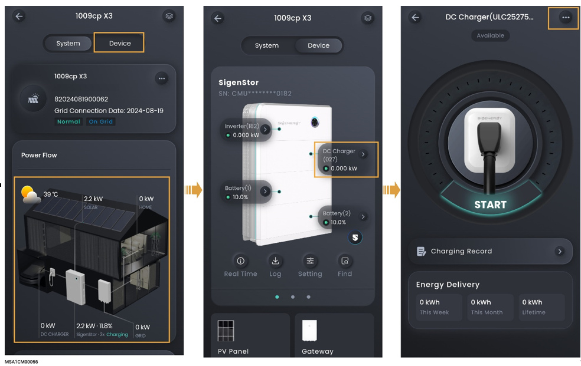

# Sigen EV DC Charging Module

<figure><figcaption></figcaption></figure>

<table><thead><tr><th width="76">序号</th><th width="171">参数名称</th><th>说明</th></tr></thead><tbody><tr><td><strong>1</strong></td><td>Charging Mode</td><td>设置Sigen EV DC Charger充电模式。可以使用的充电模式包括Fast Charging，PV Surplus Charging (EVDC > Battery),和PV Surplus</td></tr><tr><td><strong>2</strong></td><td>Charging Setting</td><td>Charging power allowed for EVDC：EVDC允许最大充电功率。</td></tr><tr><td><strong>3</strong></td><td>OCPP Settings</td><td>设置为 时，Sigen EV DC Charger可以连接到OCPP的服务器，使用者可以从URL下拉菜单选择OCPP的平台。</td></tr><tr><td><strong>4</strong></td><td>Authorization</td><td>充电鉴权设置。设置为 时，可无鉴权充电。</td></tr><tr><td><strong>5</strong></td><td>Card Management</td><td>绑定Sigen RFID card。</td></tr></tbody></table>



<mark style="color:blue;">Sigen EV DC Charging Module用户日常使用方式及注意事项请参见《Sigen EV DC Charging Module 用户手册》。</mark>
