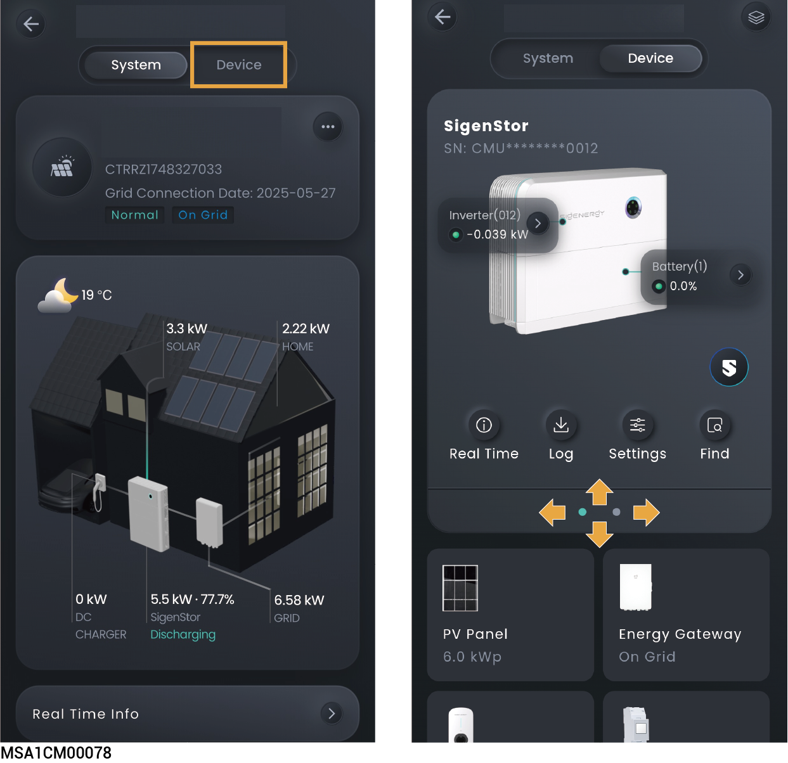
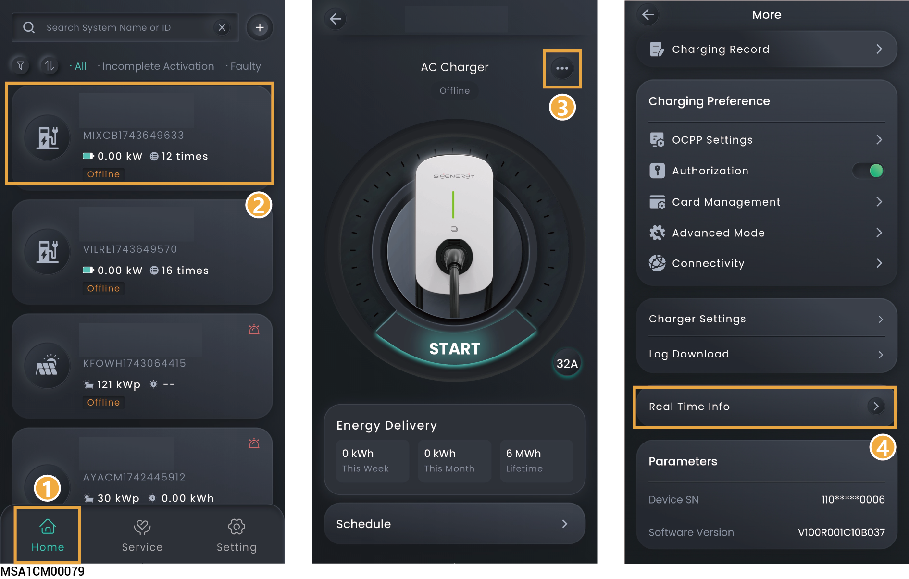
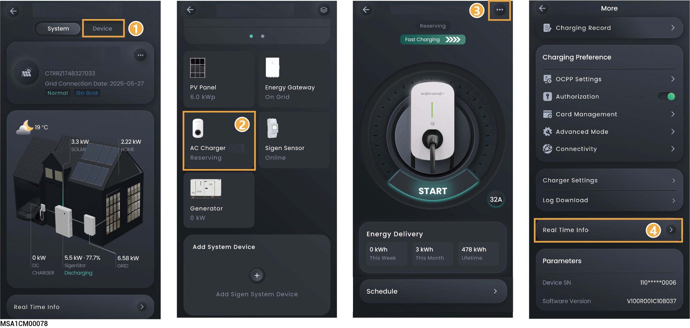

# Device Information

## Sigen Inverter/Battery



* <mark style="color:blue;">Multiple Sigen inverters/batteries are connected to the same power station. Swipe left/right or up/down to view each Sigen inverter/battery.</mark>
* <mark style="color:blue;">The app displays the SN number, which matches the SN number on the label of the Sigen inverter/battery. You can locate the specific Sigen inverter/battery you need to check by its SN number.</mark>

<figure><figcaption></figcaption></figure>

## Sigen EV AC Charger information

Go to the corresponding interface using the following method, and click "Real Time Info" to view detailed information.

### **Pure charging application**

<figure><figcaption></figcaption></figure>

### **PV charging or PV storage & charging application**

<figure><figcaption></figcaption></figure>
