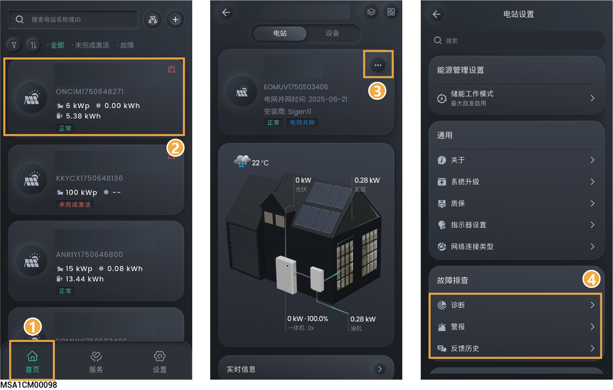

# 故障排查

<figure><figcaption></figcaption></figure>

<table><thead><tr><th width="70" align="center" valign="middle">序号</th><th width="92.6162109375" valign="middle">参数名称</th><th valign="top">说明</th></tr></thead><tbody><tr><td align="center" valign="middle">1</td><td valign="middle">诊断</td><td valign="top">若您想检查电站通信状态及电站内设备连接状态，可使用本功能<mark style="color:blue;">。</mark> 点击可进行电站诊断。</td></tr><tr><td align="center" valign="middle">2</td><td valign="middle">警报</td><td valign="top">点击查看单电站告警信息。</td></tr><tr><td align="center" valign="middle">3</td><td valign="middle">反馈历史</td><td valign="top">点击查看历史工单。</td></tr></tbody></table>
