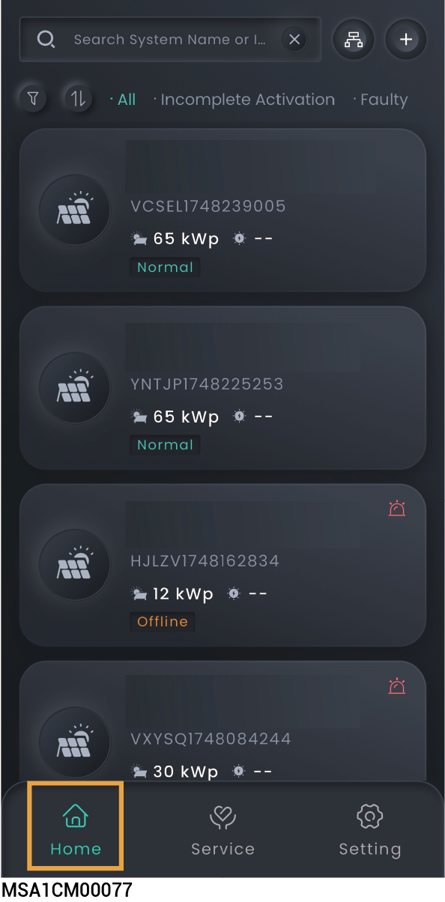
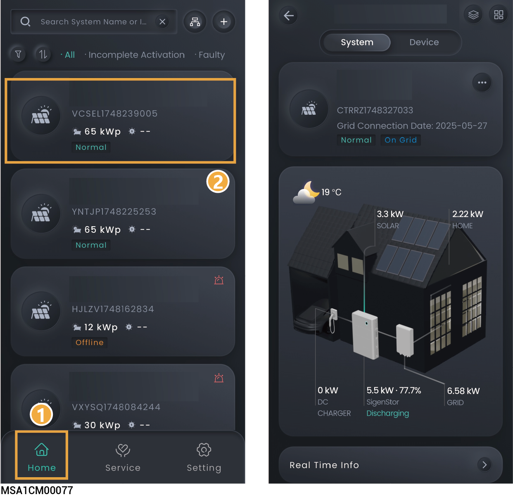
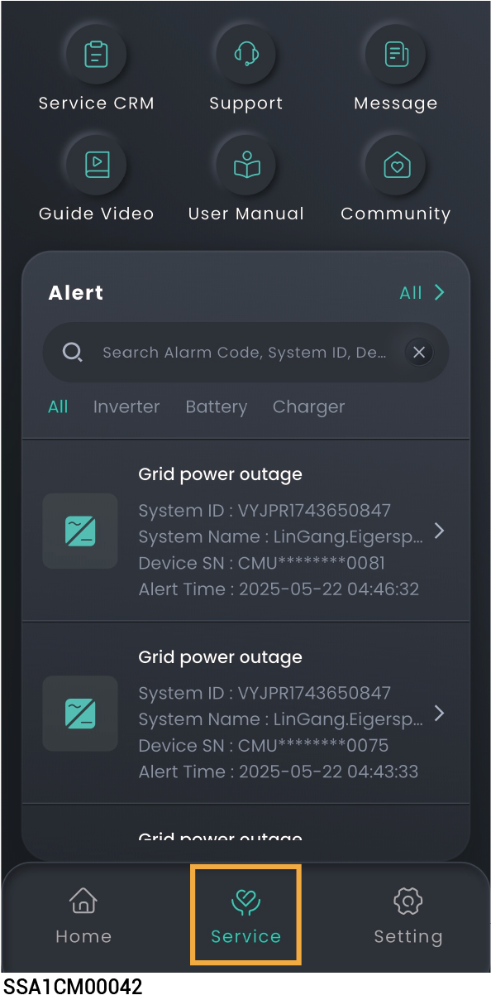

# Station information

## Multi - station Information

<figure><figcaption></figcaption></figure>

### Multi - station Screening

* You can click "Home" to check the status of all stations.
* You can click  in the upper left corner to filter the stations you want to view.

### Logical Merging of Multi - stations

After Sigencloud has set up logical integration, the upper right corner will show  . Click it to view the logical integration information.

## Single System information

<figure><figcaption></figcaption></figure>

### Single - station Information Query

* On the "Home" screen, you can click the station name you want to query to check its detailed information, such as generating capacity and revenue.
* In parallel connection scenarios, you can click "" to check the operation information of multiple devices.

### Station Page Custom Settings

* Click ，and you can create a customized power station page layout as needed.
* Click "Restore Defaults" to restore the default settings.

## Single device Information



* <mark style="color:blue;">Multiple Sigen inverters/batteries are connected to the same power station. Swipe left/right or up/down to view each Sigen inverter/battery.</mark>
* <mark style="color:blue;">The app displays the SN number, which matches the SN number on the label of the Sigen inverter/battery. You can locate the specific Sigen inverter/battery you need to check by its SN number.</mark>

<figure><figcaption></figcaption></figure>

## Service Page Information

<figure><figcaption></figcaption></figure>

<table><thead><tr><th width="82" align="center" valign="middle">No.</th><th width="128.8829345703125" valign="middle">Parameter Name</th><th valign="top">Description</th></tr></thead><tbody><tr><td align="center" valign="middle">1</td><td valign="middle">Diagnosis</td><td valign="top">To check the power station's communication status and the connection status of devices within the station, you can use this function.</td></tr><tr><td align="center" valign="middle">2</td><td valign="middle">Message</td><td valign="top">Click to view power station messages.</td></tr><tr><td align="center" valign="middle">3</td><td valign="middle">Support</td><td valign="top"><ul><li>Please feel free to reach out to us in the App if you have any questions about the use of the product.</li></ul><ul><li>To check the question history, click "History" in the upper right corner of the "Support" page.</li></ul></td></tr><tr><td align="center" valign="middle">4</td><td valign="middle">User Guide</td><td valign="top">Click to access the user guide.</td></tr><tr><td align="center" valign="middle">5</td><td valign="middle">Community</td><td valign="top">Click to enter the forum interface. Click "Community" → "Guide Video" to view product installation videos.</td></tr><tr><td align="center" valign="middle">6</td><td valign="middle">Mail</td><td valign="top">Click to purchase products. Click“”View Order History" in the upper right corner.</td></tr></tbody></table>
