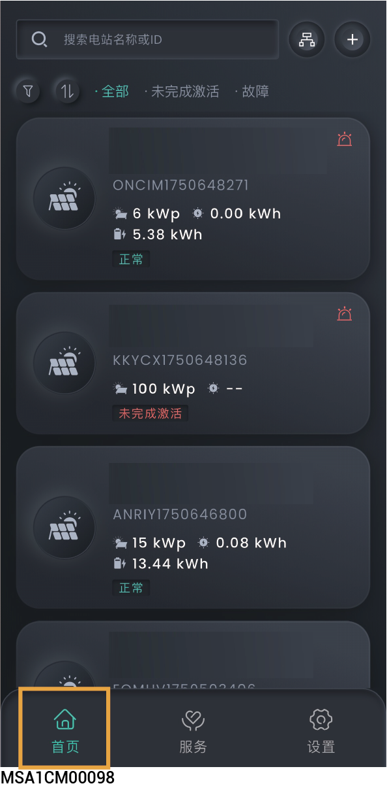
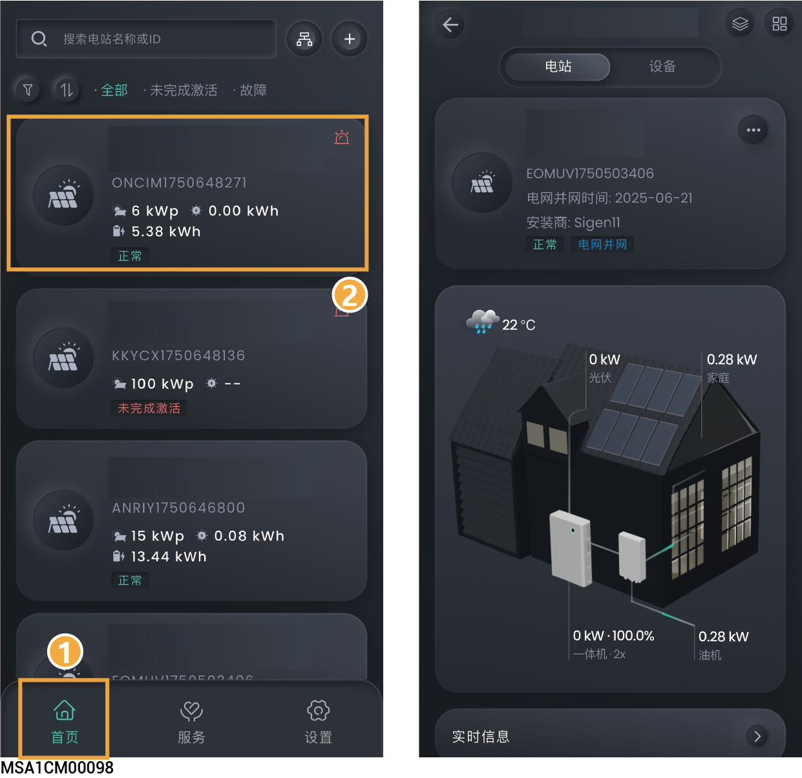
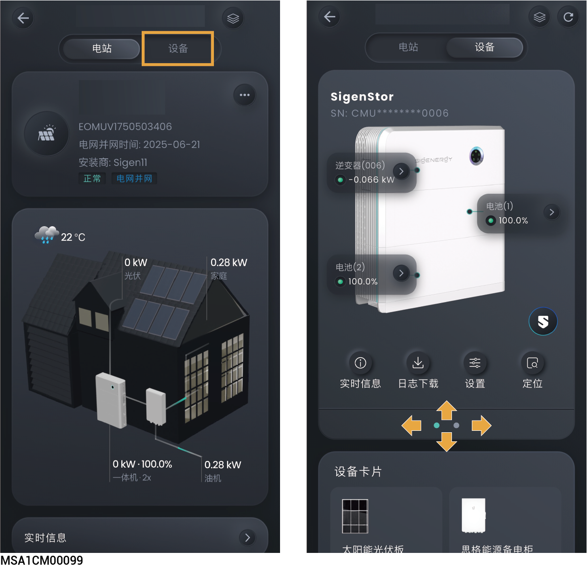
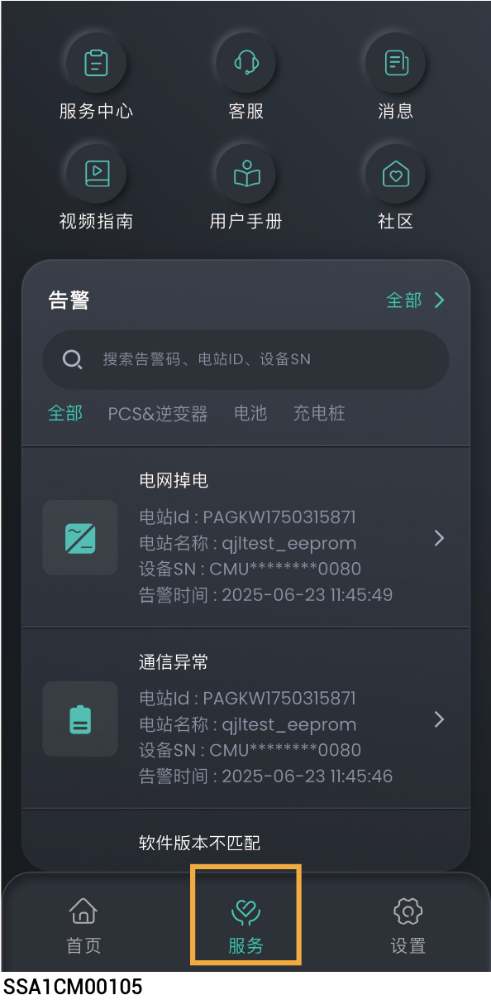

# 电站信息

## **多电站信息**

<figure><figcaption></figcaption></figure>

### **多电站筛选**

* 点击”首页”，可查看所有电站状态。
* 点击左上角，可进行筛选查看电站。

### **多电站逻辑并站**

Sigencloud设置过逻辑并站后，右上角显示，点击可查看逻辑并站信息。

## **单电站信息**

<figure><figcaption></figcaption></figure>

### **单电站信息查询**

* 在“主页”界面，点击要查询的电站名称，可查看此电站详细的发电量、收益等信息。
* 并机场景时，点击“”可同时查看多台设备的运行信息。

### **单电站页面自定义设置**

* 点击，您可根据需求，创建定制化的电站页面布局。
* 点击“恢复默认”可恢复默认设置。

## **单设备信息**



* <mark style="color:blue;">多台</mark>思格<mark style="color:blue;">逆变器/电池接入同一电站，左右或上下滑动，可查看每一台思格逆变器/电池。</mark>
* <mark style="color:blue;">App显示SN号和思格逆变器/电池标签的SN号一致，可通过SN号找到您需要查看的思格逆变器/电池。</mark>

<figure><figcaption></figcaption></figure>

## **服务页信息**

<figure><figcaption></figcaption></figure>

<table><thead><tr><th width="70" align="center" valign="middle">序号</th><th width="92.6162109375" valign="middle">参数名称</th><th valign="top">说明</th></tr></thead><tbody><tr><td align="center" valign="middle">1</td><td valign="middle">服务中心</td><td valign="top">点击进入服务中心。</td></tr><tr><td align="center" valign="middle">2</td><td valign="middle">客服</td><td valign="top"><ul><li>若您在使用设备过程中有疑问，可通过App告知我们。</li></ul><ul><li>若您想查看历史疑问，可点击“客服”界面右上角的“历史”获取。</li></ul></td></tr><tr><td align="center" valign="middle">3</td><td valign="middle">消息</td><td valign="top">点击查看电站消息。</td></tr><tr><td align="center" valign="middle">4</td><td valign="middle">用户手册</td><td valign="top">点击获取用户手册。</td></tr><tr><td align="center" valign="middle">5</td><td valign="middle">社区</td><td valign="top">
点击访问论坛界面。
<ul><li>点击“论坛”→“视频指南”，查看产品安装视频。</li></ul></td></tr><tr><td align="center" valign="middle">6</td><td valign="middle">商城</td><td valign="top">点击购买产品，点击右上角“”查看历史订单</td></tr><tr><td align="center" valign="middle">7</td><td valign="middle">告警</td><td valign="top">可查看所有电站告警信息。</td></tr></tbody></table>
