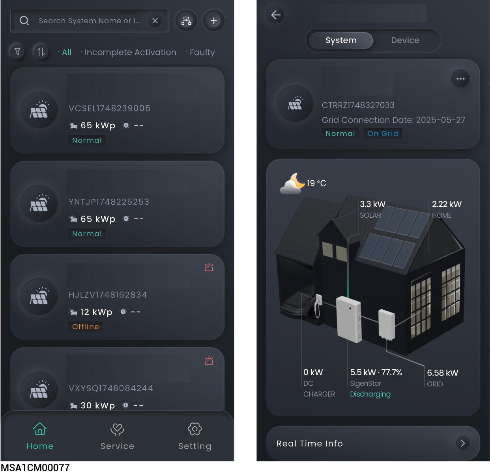
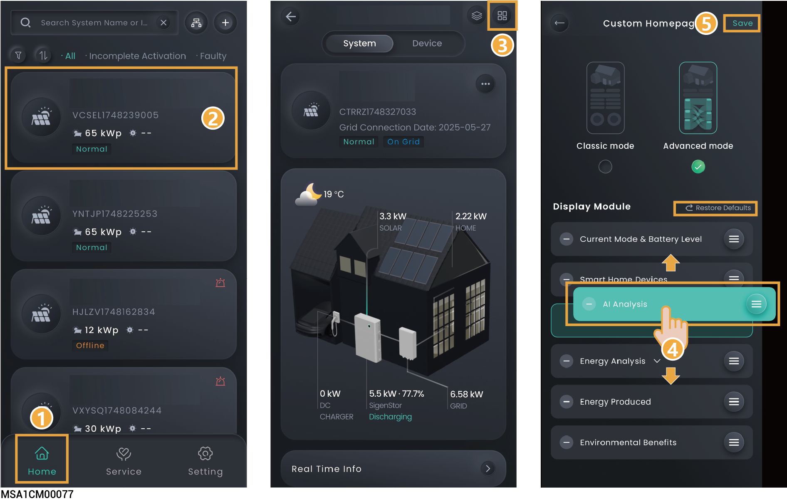

# Station information

## Multi - station Information

### Multi - station Screening



* <mark style="color:blue;">You can click "Home" to check the status of all stations.</mark>
* <mark style="color:blue;">You can click</mark>  <mark style="color:blue;">in the upper left corner to filter the stations you want to view.</mark>

<figure><figcaption></figcaption></figure>

### Logical Merging of Multi - stations



<mark style="color:blue;">After Sigencloud has set up logical integration, the upper right corner will show</mark>  <mark style="color:blue;">. Click it to view the logical integration information.</mark>

<figure><figcaption></figcaption></figure>

## **Single** System information

### Single - station Information Query



* <mark style="color:blue;">On the "Home" screen, you can click the station name you want to query to check its detailed information, such as generating capacity and revenue.</mark>
* <mark style="color:blue;">In parallel connection scenarios, you can click "</mark><mark style="color:blue;">" to check the operation information of multiple devices.</mark>

<figure><figcaption></figcaption></figure>

### Station Page Custom Settings

* Click ，and you can create a customized power station page layout as needed.
* Click "Restore Defaults" to restore the default settings.

<figure><figcaption></figcaption></figure>

## Single device Information



* <mark style="color:blue;">Multiple Sigen inverters/batteries are connected to the same power station. Swipe left/right or up/down to view each Sigen inverter/battery.</mark>
* <mark style="color:blue;">The app displays the SN number, which matches the SN number on the label of the Sigen inverter/battery. You can locate the specific Sigen inverter/battery you need to check by its SN number.</mark>

<figure><figcaption></figcaption></figure>
