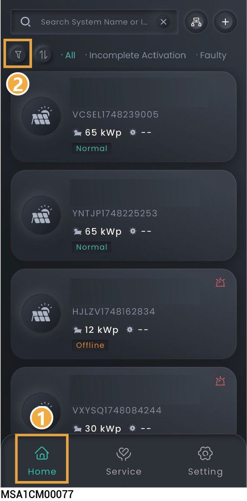
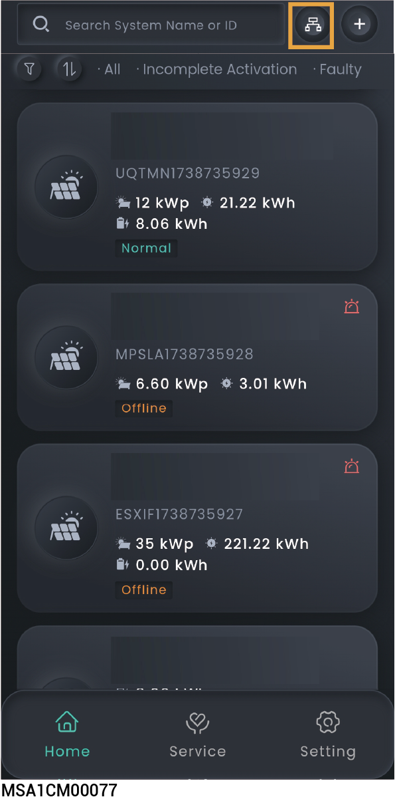

# Station operation information

You can click "Home" to check the status of all stations. You can click .png>) in the upper left corner to filter the stations you want to view.

<figure><figcaption></figcaption></figure>

After Sigencloud has set up logical integration, the upper right corner will show. Click it to view the logical integration information.

<figure><figcaption></figcaption></figure>
