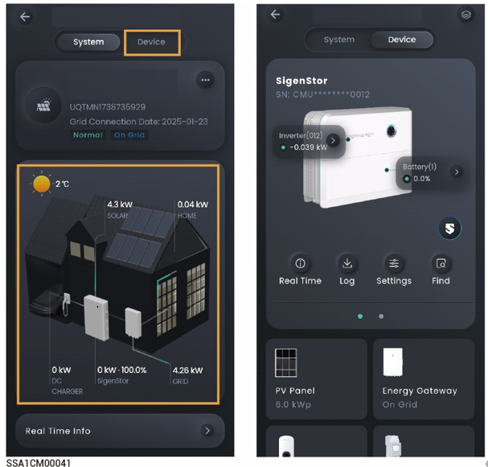

# 单设备信息

在“Home”界面，点击要查询的电站名称，点击“System”页签内能量流图上的设备，或点击“Device”页签，可查看设备的运行信息、软件版本等。

<figure><figcaption></figcaption></figure>



<mark style="color:blue;">并机场景，左右或上下滑动，通过SN找到您需要查看的SigenStor。</mark>
